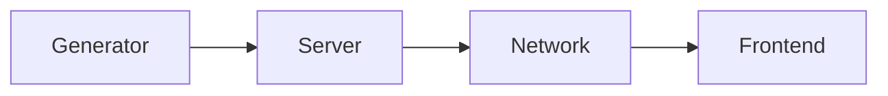

- [Introduction](#introduction)
  - [Who needs web maps?](#who-needs-web-maps)
  - [What are Slippy Maps?](#what-are-slippy-maps)
  - [Why is there no simple solution?](#why-is-there-no-simple-solution)
  - [How does VersaTiles takle the problem?](#how-does-versatiles-takle-the-problem)
- [VersaTiles Specification](#versatiles-specification)
  - [Layer: Generator](#layer-generator)
  - [Interface: Container](#interface-container)
  - [Layer: Server](#layer-server)
  - [Interface: Private/Internal Network](#interface-privateinternal-network)
  - [Layer: Network](#layer-network)
  - [Interface: Public/External Network](#interface-publicexternal-network)
  - [Layer: Frontend](#layer-frontend)
- [Tools](#tools)
- [Documentation and versatiles.org](#documentation-and-versatilesorg)
- [The Future of VersaTiles](#the-future-of-versatiles)
  - [Core values](#core-values)
  - [Community](#community)
  - [funding](#funding)
- [Improvements for this document](#improvements-for-this-document)


# Introduction

Since the early 1990s, the web has undergone significant technological advancements. New standards and tools have simplified the process of publishing text, articles, photos, videos, and other forms of media. However, publishing maps remains notably challenging - even in the era of mobile web and data journalism.

Several factors contribute to these challenges:
1. Geographic data, satellite imagery and aerial photography, is often protected by copyright, making it expensive and inaccessible for open use.   
Some governments have not yet adopted the idea of open data but insteas produce geospatial data mainly for commercial purposes.
2. Presenting map data on the web in an interactive format can be complex due to various factors such as data formats, geographic projections, server infrastructure requirements, and the intricacies of frontend frameworks. This complexity can make map integration expensive and technically demanding.

Despite theses challenges, the abundance of available data, standards, and frameworks - many of which are open or freely accessible - presents a unique opportunity to build a web map infrastructures. However, the diversity of solutions makes it difficult to put the pieces together.

VersaTiles aims to define and implement a standardised map infrastructure that provides a streamlined approach to integrating maps into web platforms.

## Who needs web maps?

Basically everyone and everything has a geo-coordinate. Even you have a geo-coordinate right now. No data is more useful than geo data, and no visualisation is more familiar than maps.

- **Data Journalism**: Journalists and media outlets often rely on maps to tell stories more effectively, providing readers with a visual context for complex issues such as war zones, political events or natural disasters.
- **Research**: Researchers focusing on environmental issues, climate change or other localised phenomena need a tool to analyse and visualise their data.
- **Emergency Response**: In times of crisis, such as natural disasters or public health emergencies, organisations need maps to visualise affected areas and communicate local information to the public.
- **Communities**: There are so many great communities out there, such as citizen science, community-based bike sharing or community-supported agriculture. They all need a simple, cost-effective way to display location information.

## What are Slippy Maps?

One of the most successful approaches for publishing interactive web maps is called 'slippy maps'. ([Wikipedia](https://en.wikipedia.org/wiki/Tiled_web_map), [OSM Wiki](https://wiki.openstreetmap.org/wiki/Slippy_map))

The first step involves projecting all geographic data onto a 2D plane using the Mercator projection. The Mercator projection has limitations. For instance, it cannot represent the North and South Poles, and objects near the equator, such as Africa, appear smaller than those near the poles, such as Greenland. Nevertheless, the Mercator projection has a significant advantage: it always shows north as up, west as left, and does not distort areas the size of a city. This makes it an excellent option for publishing a global map that can be easily zoomed in and out, displaying every location accurately.

Once all geographic data and/or images have been projected onto a global map, the challenge is to present this information on a web frontend without the need to download large amounts of data. The solution provided by 'slippy maps' is to create a square map of the world at a very low resolution (zoom level 0). To increase the resolution at zoom level 1, the 'world map' is doubled in resolution and divided into four squares (northwest, northeast, southwest, southeast). Zoom level 2 consists of 16 tiles, each with four times the resolution of the world map, and so on.

The tiles can be stored as JPEG images with a resolution of 256x256 pixels. There is a [standard way to name these files](https://wiki.openstreetmap.org/wiki/Slippy_map_tilenames), typically in the format: `{zoom_level}/{column}/{row}.jpg`.

A frontend such as MapLibre, Leaflet or OpenLayers can then load the relevant tiles and display them in the correct position, creating the illusion of a continuous map that can be zoomed and dragged to any position.

This approach works great for image tiles, such as satellite and aerial images. However, it has some disadvantages when displaying [thematic maps](https://en.wikipedia.org/wiki/Thematic_map), such as city maps. When zooming in, the map has to transition from one zoom level to another, resulting in disappearing and reappearing labels. Image tiles do not provide a smooth zooming experience.

Therefore, the concept of 'slippy maps' was improved by including vector data instead of images. [Vector tiles](https://wiki.openstreetmap.org/wiki/Vector_tiles) can store points, paths, polygons, and text - like SVG. But since SVG is too cumbersome, Mapbox developed a [vector tiles standard](https://docs.mapbox.com/data/tilesets/guides/vector-tiles-standards) that stores geographic data as Google Protobufs (PBF). The frontend should read the geographic data and draw it accordingly. One benefit is the ability to define the map style in the frontend, allowing for adjustments to be made to the map's brightness, saturation, and color. Rendering all geographic data can be complex, so vector tiles are typically rendered on the GPU using libraries such as WebGL, OpenGL, or Vulcan to ensure speed and responsiveness.

## Why is there no simple solution?

Generating, serving, and visualizing map tiles can be a complex process due to various tile formats, hosting options, storage and generation methods, serving and display techniques, vector data styling approaches, and data source combinations. Additionally, frontends must draw vector data, satellite images, hillshading, data visualization layers, and interactive frontend elements.

Mapbox aims to address these challenges by providing a comprehensive software suite. However, the solution can be expensive, leads to vendor lock-in, and raises privacy concerns.

It would be ideal to have an open-source system. Although open-source alternatives exist for each problem, integrating them into one infrastructure can be challenging. Developing a single software solution that addresses all problems at once and remains flexible enough for various use cases is not feasible.

## How does VersaTiles takle the problem?

Developing a solution covering so many problems reminded me on how the internet was build: Instead of building a single software that can run the whole internet, they developed the OSI model to cut the problem into smaller pieces and defined standards for every part. This allows everyone to implement there own software solutions and can be sure, that it will work together with other implementation that fullfills the OSI standards.

So it made perfect sense to use OSI as a role model, cut the big problem into smaller ones, develop a basis for standardising each part/layers and their interconnections, to ensure that all parts fit together.

We defined the 'big problem' as a pipeline, that generates, serves and displays map data. Then we cut this pipeline into 4 sub segments and developed a specification, that defines the interface between these pipeline segments. Additionally we provide one or more free reference implementations for every segment, and provide a reference pipeline that everyone can use for free.

The advantages: Everybody can use our map tile service for free or can setup parts or the full pipeline on their own infrastructure. It also allows to deviate from our reference pipeline at any point and still be able use every other part of the pipeline. This also allows to experiment and find totally new uses cases that we can't imagine yet.

Our reference pipeline consists of four segments (layers):
1. **Generator:** Creates map tiles from a data source, like vector tiles from OpenStreetMap data or image tiles from satellite or aerial photos.
2. **Server:** Manages the storage and distribution of map tiles.
3. **Network:** Handles all network related issues like TLS certificates, load balancing, caching and CORS.
4. **Frontend:** Provides the user interface for interactive maps.




> [!WARNING] VersaTiles is still under heavy development
> Be aware that not all specifications of the pipeline are final yet. We still encounter unforseen use cases, issues or features that require minor adjustments. But the big majority is pretty stable.

# VersaTiles Specification

==split specification from implementation, e.g.: OSM generator, hillshade generator, ...

## Layer: Generator

This Generator Layer is responsible for generating tiles. This can be image or vector tiles.

For vector tiles we don't use the [OpenMapTiles schema](https://openmaptiles.org/schema/) since we don't believe its open enough. Especially the requirement to add links to the website of MapTiler or to pay license fees feels more like a SEO campaign instead of a free standard. That's why we decided to use the free [Shortbread schema](https://shortbread-tiles.org) originally developed by GeoFabrik. We understand the consequences, like that map styles based on "OpenMapTiles" can't be used directly for "Shortbread tiles". But if we start from scratch, then let's do it right from the beginning.

Of course you can deviate from our recommendations and generate, serve and display vector tiles in OpenMapTiles schema, but we will not actively work on this path and focus on Shortbread.

BTW: Users can skip the part of generating tiles and just download our prepared vector tiles covering the whole planet: [download.versatiles.org](https://download.versatiles.org)

### Requirements/Recommendations

- Tiles must be packaged in a [*.versatiles containers](https://github.com/versatiles-org/versatiles-spec/blob/v02/v02/container/readme.md).
- Vector tiles must conform to the [Shortbread schema](https://shortbread-tiles.org/).
- Containers must include detailed metadata compliant with [TileJSON 3.0.0](https://github.com/mapbox/tilejson-spec/tree/master/3.0.0), specifically:
    - `attribution` detailing source data copyrights.
    - `vector_layers` describing the vector tiles' layered composition.
- Use optimal compression techniques to efficiently reduce tile size without compromising data integrity. Recommended methods include:
    - Brotli compression for vector tiles.
    - WebP format for raster tiles to improve loading efficiency and reduce bandwidth.

### Status

- [x] Implement using Tilemaker [*](https://github.com/versatiles-org/shortbread-tilemaker)
- [x] Use Shortbread schema [*](https://github.com/versatiles-org/shortbread-tilemaker)
- [ ] add more languages besides local language, english and german
- [x] use .versatiles instead of .mbtiles [*](https://github.com/versatiles-org/versatiles-converter)
- [ ] merge the Converter into the Generator and use Docker [*](https://github.com/versatiles-org/versatiles-generator/issues/1)
- [ ] use Tilemaker 3.0.0 to reduce the memory requirements [*](https://github.com/versatiles-org/shortbread-tilemaker/issues/7
- [ ] migrate to cheaper Cloud provider (Hetzner)
- [ ] reduce size of vector tiles [*](https://github.com/versatiles-org/versatiles-generator/issues/7)
- [ ] improve lower zoom levels [*](https://github.com/versatiles-org/versatiles-generator/issues/2)
- [ ] generate hill shading [*](https://registry.opendata.aws/terrain-tiles/)
- [ ] generate satellite imagery (using Landsat/SENTINEL, aerial photos from national open data platforms, open MAXAR images)

## Interface: Container

One of the most asked question is why we developed our own container format. There are multiple reasons behind that:

One of the most important feature for the OSM community is to automatically update their own map tile server to be always up to date and see any changes to OSM in minutes. This might be an important requirement for OSM contributors, but it is totally unneccessary for almost everyone else. Especially new rooms, data journalists, NGOs and most other frontend developers need a simple background map that can be 3 month old. We neither want to use the data for monitoring recent changes, nor use map tiles for acurate car navigation.
But the requirement of being always up-to-date creates a lot of complexity and ressource requirements, since you have to store and index all OSM objects in a Postgresql/Postgis database, fetching updates every minute and update all changed tiles on the fly. Generating vector tiles from a Postgresql database is also still in a experimental phase ([osm2pgsql](https://osm2pgsql.org/examples/vector-tiles/)). This requirement makes it impossible to build a simple, low cost solutions. That's why we abandoned the idea of using a database and instead focus on pregenerated tiles stored in a file container.

The most used container format is [MBTtiles](https://wiki.openstreetmap.org/wiki/MBTiles). It's basically just a SQLite database with a table containing a row for each tile, while the tile data is stored as gzipped blobs in one column. This makes the container very flexible, but it has some disadvantages:
1. The container must be on the server on a local or mounted drive and can't be stored on a remote storage like a cloud object storage. 
2. You need SQLite as a dependency.
3. Querying or processing many tiles is slow since SQLite is not optimized for high throughput.
A different approach is to use a cloud optimized map tile container format like [COMTiles](https://github.com/mactrem/com-tiles) or [PMTiles](https://github.com/protomaps/PMTiles). They basically concatenate all tiles into a big file and append an index that can be used to lookup the byte range of each tile inside of the container. Both container formats differ in their implementation because they are optimised for different usecases. For example PMTiles is optimized to be stored on public cloud storage like AWS S3 and can be accessed without any server directly via a JavaScript implementation using HTTP range requests. This approach of serverless tile hosting is a really nice idea but has some major disadvantages, like slow initialisation time, uncompressed tile data, and no good way of caching requests. Additionally we want do be independent from container formats that have different use cases and might develop into a different direction.

That's why we heavily learned from COMTiles and PMTiles a build our own, very simple container format: https://github.com/versatiles-org/versatiles-spec/blob/main/v02/readme.md

One of the many advantages is a killer feature that we haven't seen yet anywhere else: We host planet wide tiles as VersaTiles containers at [download.versatiles.org](https://download.versatiles.org). But if you need just a portion, like a continent, country or city, you don't have to download the full planet and extract the necessary tiles. Instead you can use our Rust implementation to "convert" our hosted container to a local container using a bounding box as filter, e.g.:
```bash
versatiles convert --bbox "5,45,10,48" https://download.versatiles.org/planet-latest.versatiles switzerland.versatiles
```
All HTTP requests retrieving sequential tiles are merged into single once to download thousands of tiles at once. The resulting performance allows you to extract a part of the planet with no overhead at all: https://github.com/versatiles-org/versatiles-documentation/blob/main/guides/download_tiles.md#partial-download. Only the internet connect limits the speed of downloading parts of the world.


### Requirements/Recommendations
- It is required to follow the VersaTiles container specification: https://github.com/versatiles-org/versatiles-spec/blob/main/v02/readme.md
- It is required to handle HTTP headers correctly, especially:
	- `Content-Type` using the correct MIME type.
	- `Accept-Encoding` and `Content-Encoding` for compressed data. Recompress data if neccessary.
	- `Cache-Control` to signal to proxies, CDNs and browser how to cache the content.
	- CORS headers like `Access-Control-Allow-Origin` if needed
- Traffic costs money. It is recommended use optimal compression for tile data.

### Status

- [x] include meta data
- [x] support all tile formats (images and vector data)
- [x] support all compressions (gzip, brotli)
- [x] allow bbox download
- [x] finish [specification](https://github.com/versatiles-org/versatiles-spec/blob/main/v02/readme.md)

## Layer: Server

The Server layer is responsible for serving map tiles and additional static files via HTTP. Static files can be styles, sprites, fonts, JavaScript libraries, and so on.

### Requirements/Recommendations

- Must recognize and process [_VersaTiles containers_](https://github.com/versatiles-org/versatiles-spec/blob/v02/v02/container/readme.md).
- The server should know its public URL for resource referencing.
- Adopts a structured folder hierarchy for organized tile and metadata access:
    - `/tiles/`: Central directory for tile retrieval.
        - `/tiles/sources.json`: Comprehensive index of available tile sources.
        - `/tiles/{name}/{z}/{x}/{y}`: Standardized tile access endpoints.
        - `/tiles/{name}/tiles.json`: Incorporates a legitimate [TileJSON 3.0.0](https://github.com/mapbox/tilejson-spec/tree/master/3.0.0) document.
    - `/assets/`: Storage for additional resources like sprites, glyphs, styles, and MapLibre GL JS files.
        - `/assets/sprites/`
        - `/assets/glyphs/`
            - `/assets/glyphs/{name}`: Font names must only contain letters, numbers and underscore
            - `/assets/glyphs/fonts.json`: Index of available fonts.
        - `/assets/styles/`
        - `/assets/maplibre/maplibre.*`: JavaScript and CSS of newest MapLibre GL JS
- Might implement handling of CORS requests to facilitate resource sharing across different domains.
- Configurability via `config.yaml` for custom server setup, including domain configuration, IP/port listening preferences, operational modes (e.g., development vs. production), tile source definition, and static content management:

```yaml
# public URL
domain: 'https://example.org' # required

# listen to
listen_ip: '0.0.0.0' # default: 0.0.0.0
listen_port: 3000 # default: 8080

# set to true use only minimal recompression and only if necessary, e.g. for development
fast: true # default: false

# set tile sources, required
tile_sources:
- { name: 'osm', source: './planet.versatiles' }
- { name: 'landsat', source: 'https://example.org/landsat.versatiles' }

# set static content, optional
static_content:
- { source: './styles', prefix: 'assets/styles' }
- { source: './frontend.tar' }

# CORS allow list, optional
allow_origin:
- 'versatiles.org'
- 'example.org'
- 'someone.org'

# CORS block list, optional
block_origin:
- 'someonewhosaysheisnotanazibut.org'
```

### Rust implementation
We provide a very performant [Rust implementation](https://github.com/versatiles-org/versatiles-rs) as CLI application and as Rust crate (library).

The binary runs on x86 and ARM (64 Bit), on:
- [x] Linux
- [x] MacOS
- [ ] Windows

Beside the source code that can easily be [compiled using cargo](https://github.com/versatiles-org/versatiles-documentation/blob/main/guides/install_versatiles.md#building-from-source) we also provide:
- [x] [binary releases](https://github.com/versatiles-org/versatiles-rs/releases) via GitHub
- [ ] NixOS
- [ ] Snap
- [ ] Flatpak
- [x] [Homebrew](https://github.com/versatiles-org/homebrew-versatiles)

We also provide [Docker images](https://hub.docker.com/u/versatiles) ([Repo](https://github.com/versatiles-org/versatiles-docker)) using:
- Debian, Alpine and scratch
- [excluding](https://hub.docker.com/r/versatiles/versatiles/tags) and [including](https://hub.docker.com/r/versatiles/versatiles-frontend/tags) all static files of the full frontend

We also want to add features like
- [ ] handle CORS correctly
- [ ] fully support the standardized `config.yaml`
- [ ] generate statistics (histograms) of tile sizes
- [ ] deep inspection of vector tiles to debug the content
- [ ] implement "diff" and "patch" commands to generate VersaTiles containers that only contain new (changed) tiles ("diff") and apply this diff to a container to update these tiles ("patch"). This might be a helpful feature to automatically update planet wide tile containers.
- [ ] implement an "overlay" command that allows to overlay image tiles, e.g. overlay aerial image tiles onto satellite image tiles
- [ ] improve the "overlay" command by implementing a [multi-scale approach](https://en.wikipedia.org/wiki/Multi-scale_approaches) to seamlessly overlay image tiles (see also [Gradient-domain image processing](https://en.wikipedia.org/wiki/Gradient-domain_image_processing))

### NodeJS implementations

We also provide a NodeJS implementation:
- [x] as [NPM library](https://github.com/versatiles-org/node-versatiles-container)
- [x] as simple [server](https://github.com/versatiles-org/node-versatiles-server)
- [ ] fully support config.yaml
- [ ] handle CORS

We provide also a solution especially suited for data journalist using Google Cloud. It's basically a NodeJS Cloud Run server for serving static files from a bucket via CDN. It handles all HTTP headers, MIME types, caching and optimal (re)compression. But the killer feature is that if you request a `*.versatiles` file it will automatically provide an API for serving tiles right out of the bucket, including a preview mode.
- [x] [Google Cloud Run server](https://github.com/versatiles-org/node-versatiles-google-cloud) for very easy integration of map data into data visualisations, e.g. for editorial departments

### Status

Additionally we plan to:
- [ ] test VersaTiles on Raspberry Pi to ensure it is easy to serve global maps in special scenarios like NGOs in crisis regions
- [ ] implement a tile server in C for ESP32, serving a VersaTiles container from a SD card. We are not sure, if there is actually a use case for a 7$ mobile map server hardware - but we want to do it anyway just to demo how simple and efficient VersaTiles is. (low priority)
- [ ] [standardise](https://github.com/versatiles-org/versatiles-spec/blob/v02/v02/readme.md#server-layer-specifications) the server configuration file to make it easier to migrate between different server implementation
- [ ] [standardise](https://github.com/versatiles-org/versatiles-spec/blob/v02/v02/readme.md#server-layer-specifications) the API

## Interface: Private/Internal Network

At this point the server handles HTTP request.

We explicitly recommend to not implement additional features in the server like TLS, to reduce the complexity, but instead leave network features to the network layer.
## Layer: Network

The Network Layer covers all aspects that are necessary if you want to serve files publicly.
### Requirements/Recommendations

- Handle Transport Layer Security (certificates, …)
- ensure security (against DDOS, )
- ensure availability (load balancing, ...)
- ensure speed (CDN, …)
- …

### Status

- Test and document CDN solutions
	- [x] Google CDN
	- [x] NGINX
	- [x] bunny.net
	- [ ] Akamai
	- [ ] AWS
	- [ ] Azure
- NGINX as standard solution
	- [x] test NGINX
	- [ ] add documentation

## Interface: Public/External Network
Public facing network

## Layer: Frontend

The Frontend Layer is the user interface that renders the map tiles.
There are many frameworks available, like MapLibre GL JS, Mapbox, OpenLayers, Leaflet, ... But we focus on MapLibre since this framework is the only one that can render vector tiles really fast on the GPU, has a free license and provides libraries for JavaScript, iOS and Android.


### Requirements/Recommendations

- Must ensure compatibility with both vector and raster tiles.
### Status


- [x] Style-Engine
- [x] Style Library
- [x] Fonts
- [x] Sprites
- [ ] Right to left?
- [ ] precompressed Tar
- [ ] OMT -> Shortbread

# Tools

- [ ] Editorial Tools
	- [ ] Locator Map
	- [ ] Area Map
	- [ ] Points Map
- [ ] GeoJSON BBOX tool
- [ ] Install via bbox on Raspberry, Linux, ...
- [ ] Style-Maker
- [ ] Backend Renderer
- [ ] VersaTiles-Studio
- [ ] Generate city maps

# Documentation and versatiles.org

**Explanation**

- [ ] Check if browsers limit the number of simultanous requests per domain and if multiple subdomains would actually increase loading speed.

**Requirements**


**Recommendations**


**Status**

- [ ] add to website 

- [ ] Specification
- [ ] Guide: Install plattforms/via packages
- [ ] Guide: CORS
- [ ] Guide: TLS
- [ ] Guide: CDN


# The Future of VersaTiles

## Core values
open standard, open data, open source
## Community
## funding
non commercial
How to fund the infrastructure?
How to fund the standardization and development?

# Improvements for this document
Your compendium on "VersaTiles" is an ambitious and comprehensive document that outlines the vision, structure, and technical specifications of an open-source map stack. It addresses key challenges in the realm of interactive web mapping, proposing a layered architecture similar to the OSI model for modular development and integration. Here's how it can be improved and extended:

**Clarity and Consistency**
- [ ] Ensure technical terms and acronyms are defined upon first use. For readers less familiar with web mapping or specific technologies, a glossary might be useful.
- [ ] Use consistent terminology and spelling (e.g., "use cases" vs. "uses cases", "VersaTiles takle" should be "VersaTiles tackle").
- [ ] Review for typographical errors and grammatical inconsistencies to enhance readability.

**Use Cases Expansion**
- [ ] Flesh out the "Use cases" section with specific scenarios where VersaTiles provides a distinct advantage. Include examples from journalism, NGOs, education, and other fields to illustrate its versatility.

**Technical Depth**
- [ ] Provide more technical details or examples in sections like "Layer: Generator" and "Layer: Server", especially around implementation strategies and challenges.
- [ ] In "Layer: Network", discuss the considerations for selecting between different CDN providers or network configurations, possibly including case studies or benchmarks.

**Community Engagement**
- [ ] Detail how the community can contribute to VersaTiles. This could include a roadmap for development, guidelines for contributions, and channels for communication (e.g., forums, GitHub, social media).
- [ ] Highlight current contributors and partners to showcase community support and encourage new participants.

**Funding and Sustainability**
- [ ] Elaborate on the "funding" section to address how the project plans to remain financially sustainable while adhering to its core values. Discuss potential revenue models, grants, donations, or sponsorships.

**Accessibility and Internationalization**
- [ ] Consider aspects of accessibility, both in terms of the web interface (e.g., support for screen readers, keyboard navigation) and geographic diversity (e.g., multi-language support, cultural considerations in map design).
- [ ] Address how VersaTiles can accommodate regions with limited internet access or restrictions on data usage.

**Technical Documentation and Tutorials**
- [ ] Expand the "Documentation and versatiles.org" section with links to API documentation, SDKs, libraries, and tools that developers can use to integrate VersaTiles into their applications.
- [ ] Include step-by-step tutorials for common tasks, such as setting up a VersaTiles server, customizing map styles, or integrating maps into web applications.

**Versioning and Compatibility**
- [ ] Discuss how versioning of the VersaTiles specification will be managed, including backward compatibility, deprecation policies, and how updates are rolled out to users.

**Security Considerations**
- [ ] Highlight security practices and recommendations for users hosting their own VersaTiles infrastructure. Discuss encryption, authentication, and protection against common web vulnerabilities.

**Feedback Loop**
- [ ] Establish mechanisms for gathering user feedback, conducting usability testing, and adapting the project roadmap based on community input.
