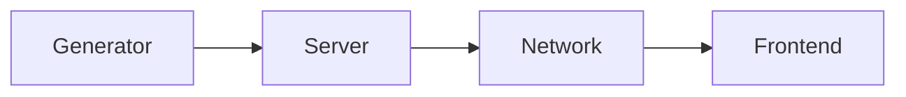

- [Introduction](#introduction)
  - [Who needs web maps?](#who-needs-web-maps)
  - [What are Slippy Maps?](#what-are-slippy-maps)
  - [Why is there no simple solution?](#why-is-there-no-simple-solution)
  - [How does VersaTiles tackle the problem?](#how-does-versatiles-tackle-the-problem)
- [VersaTiles Layer Specification](#versatiles-layer-specification)
  - [Layer: Generator](#layer-generator)
  - [Interface: Container](#interface-container)
  - [Layer: Server](#layer-server)
  - [Interface: Private/Internal Network](#interface-privateinternal-network)
  - [Layer: Network](#layer-network)
  - [Interface: Public Network](#interface-public-network)
  - [Layer: Frontend](#layer-frontend)
- [VersaTiles Frontend Specification](#versatiles-frontend-specification)
  - [Folder Structure](#folder-structure)
  - [Folder: `/assets/`](#folder-assets)
  - [Folder: `/assets/glyphs/`](#folder-assetsglyphs)
  - [File: `/assets/glyphs/index.json`](#file-assetsglyphsindexjson)
  - [File: `/assets/glyphs/font_families.json`](#file-assetsglyphsfont_familiesjson)
  - [Folder: `/assets/sprites/`](#folder-assetssprites)
  - [File: `/assets/sprites.json`](#file-assetsspritesjson)
  - [Folder: `/tiles/`](#folder-tiles)
  - [Files: `/tiles/{tile_id}/{z}/{x}/{y}{.ext}`](#files-tilestile_idzxyext)
  - [File: `/tiles/index.json`](#file-tilesindexjson)
- [Tools](#tools)
- [versatiles.org](#versatilesorg)
- [Show cases](#show-cases)
- [The Bigger Picture](#the-bigger-picture)
  - [The Future of VersaTiles](#the-future-of-versatiles)
  - [Core Values](#core-values)
  - [Support](#support)
  - [Legal Entity](#legal-entity)


------------------------------------------


# Introduction

Since the early 1990s, the web has seen significant technological advances. New standards and tools have made it easier to publish text, articles, photos, videos and other forms of media. However, publishing maps remains particularly challenging.

Several factors contribute to these challenges:
1. Geographical data, satellite imagery and aerial photography, is often copyrighted, making it expensive and inaccessible for open use.   
Some governments have not yet embraced the idea of open data, instead producing geospatial data mainly for commercial purposes.
1. Presenting map data on the web in an interactive format can be complex due to various factors such as data formats, geographic projections, server infrastructure requirements and the intricacies of front-end frameworks.

Despite these challenges, the wealth of available data, standards and frameworks - many of which are open or freely available - provides a unique opportunity to build a web map infrastructure. However, the diversity of solutions makes it difficult to put the pieces together.

VersaTiles aims to define and implement a standardised map infrastructure that provides a streamlined approach to integrating maps into web platforms.


## Who needs web maps?

Basically, every person and every object on the planet has a geo-coordinate. Even you have a geo-coordinate right now. No data is more useful than geodata, and no visualisation is more familiar than maps.

- **Data Journalism**: Journalists and media outlets often rely on maps to tell stories more effectively, providing readers with a visual context for complex issues such as war zones, political events or natural disasters.
- **Research**: Researchers focusing on environmental issues, climate change or other localised phenomena need a tool to analyse and visualise their data.
- **Emergency Response**: In times of crisis, such as natural disasters or public health emergencies, organisations need maps to visualise affected areas and communicate local information to the public.
- **Communities**: There are so many great communities out there, such as citizen science, community-based bike sharing, community-supported agriculture and many more, that need a simple, cost-effective way to display location information.


## What are Slippy Maps?

One of the most successful techniques for publishing interactive web maps is called 'slippy maps'. ([Wikipedia](https://en.wikipedia.org/wiki/Tiled_web_map), [OSM Wiki](https://wiki.openstreetmap.org/wiki/Slippy_map))

The first step is to project all geographic data onto a 2D plane using the [Mercator projection](https://en.wikipedia.org/wiki/Mercator_projection). The Mercator projection has its limitations. For example, it cannot represent the north and south poles, and objects near the equator, such as Africa, appear smaller than those near the poles, such as Greenland. However, the Mercator projection has one major advantage: it always shows north as up, west as left, and does not distort small areas the size of a city. This makes it an excellent option for publishing a global map that can be easily zoomed in and out to show every location accurately.

Once all the geographical data and/or images have been projected onto a world map, the challenge is to present this information on a web front-end without having to download large amounts of data. The solution provided by 'slippy maps' is to create a square world map at a very low resolution (zoom level 0). To increase the resolution at zoom level 1, the 'world map' is doubled in resolution and divided into four squares (northwest, northeast, southwest, southeast). Zoom level 2 consists of 16 tiles. The rule is that zoom level n has 4ⁿ tiles.

The tiles can be saved images (such as JPEG or PNG) with a resolution of 256x256 pixels. There is a [standard way of naming these files](https://wiki.openstreetmap.org/wiki/Slippy_map_tilenames), typically in the format: `{zoom_level}/{column}/{row}.jpg`.

A frontend such as [MapLibre](https://maplibre.org/), [Leaflet](https://leafletjs.com/) or [OpenLayers](https://openlayers.org/) can then load the relevant tiles and display them in the correct position, creating the illusion of a continuous map that can be zoomed and dragged to any position.

This approach works great for image tiles, such as satellite and aerial images. However, it has some disadvantages when displaying [thematic maps](https://en.wikipedia.org/wiki/Thematic_map), such as city maps. When zooming in, the map has to transition from one zoom level to another, resulting in disappearing and reappearing labels. Image tiles do not provide a smooth zooming experience.

So the concept of 'slippy maps' has been improved by using vector data instead of images. [Vector tiles](https://wiki.openstreetmap.org/wiki/Vector_tiles) can store points, paths, polygons and their properties - much like SVG. But because SVG is too cumbersome, Mapbox developed a [vector tiles standard](https://docs.mapbox.com/data/tilesets/guides/vector-tiles-standards) that stores geographic data as compact [protobufs](https://protobuf.dev/) (PBF). The frontend should read the geographic data and draw the map accordingly. One advantage is that the map style can be defined in the frontend, allowing the colour or even the language of the map to be adjusted. Rendering large amounts of vector data can be computationally expensive, so vector tiles are typically rendered on the GPU using libraries such as WebGL, OpenGL or Vulcan.


## Why is there no simple solution?

Generating, serving, and visualising map tiles can be a complex process due to the variety of tile formats, hosting options, storage and generation methods, serving and display techniques, map data styling approaches, and data source combinations. In addition, front-ends need to draw vector data, satellite imagery, hillshading, data visualisation layers, and interactive front-end elements.

Commercial vendors such as Mapbox address these challenges by offering a comprehensive software suite. However, the solution is expensive, leads to vendor lock-in and raises privacy concerns.

A free and open source system would be ideal. Although open source alternatives exist for each problem, integrating them into a single infrastructure can be challenging. It is not feasible to develop a single software solution that solves all the problems at once and remains flexible enough for different use cases.


## How does VersaTiles tackle the problem?

To find a solution to such a wide range of problems, we looked to the development of the Internet itself for inspiration. Instead of creating a single piece of software to run the entire Internet, the OSI model was developed. This model segments the problem into manageable pieces and defines specifications for each component. This segmentation ensures that individual software solutions can be developed independently while remaining compatible with others that adhere to OSI standards.

Using the OSI model as a blueprint, we broke down the complex problem into smaller, more manageable pieces. This allowed us to standardise each segment and its interconnections, ensuring cohesion across all components.

The 'big problem' was conceptualised as a pipeline that generates, serves and displays map data. We divided the pipeline into four sub-segments and developed specifications to define the interfaces between them. We also provide free reference implementations for each segment, as well as a reference pipeline that anyone can use for free.

This allows anyone to use our map tile service for free, or to use parts or the entire pipeline in their own infrastructure. VersaTiles allows you to deviate from the reference pipeline at any point and still use all the other pipeline components. This ensures that you have a stable platform to use and build on, but also gives you the flexibility and freedom to experiment.


------------------------------------------


# VersaTiles Layer Specification

Our reference pipeline has four segments:



1. **Generator:** Creates map tiles from a data source, such as vector tiles from OpenStreetMap data or image tiles from satellite or aerial imagery.
2. **Server:** Manages the storage and distribution of map tiles.
3. **Network:** Handles all network-related issues, including TLS certificates, load balancing, CORS and caching.
4. **Frontend:** Provides the user interface for interactive maps.

> [!WARNING] VersaTiles is still under development.
Please note that not all pipeline specifications are final and we may encounter unforeseen use cases, problems or features that require minor adjustments. However, the majority of the pipeline is stable.


## Layer: Generator

The generator layer creates map tiles, which can be either image or vector tiles.

We have chosen not to use the [OpenMapTiles schema](https://openmaptiles.org/schema/) for vector tiles because we feel it does not embody the openness we are aiming for. In particular, the requirement to include links to the MapTiler website or to pay licensing fees seems more like a marketing strategy than a commitment to open standards. Instead, we have chosen to use the free [Shortbread schema](https://shortbread-tiles.org) originally developed by GeoFabrik. We acknowledge that this choice has implications, such as the incompatibility of map styles designed for OpenMapTiles vs. Shortbread. 

But if we're going to start from scratch, let's do it right from the very beginning.

While users are free to deviate from our recommendations and use the OpenMapTiles schema, we will continue to focus our efforts on the Shortbread schema.

Users can skip the tile generation process entirely and download our prepared map tiles for the entire planet directly from [download.versatiles.org](https://download.versatiles.org).


### Requirements/Recommendations

- Tiles SHOULD be packed in a [*.versatiles container](https://github.com/versatiles-org/versatiles-spec/).
- Vector tiles SHOULD conform to the [Shortbread Schema](https://shortbread-tiles.org/).
- Containers SHOULD include detailed metadata conforming to [TileJSON 3.0.0](https://github.com/mapbox/tilejson-spec/tree/master/3.0.0), specifically:
  - `attribution` detailing the copyright of the source data.
  - `vector_layers` describing the vector tile layers and their properties.
- You SHOULD use optimal compression techniques to efficiently reduce tile size without compromising data integrity. Recommended methods include:
  - Use Brotli compression for vector tiles.
  - Ese WebP format for raster tiles.
- The filename of the container SHOULD follow the format `<content>[.<schema>][.<coverage>][.<date>].versatiles` where:
  - `<content>` describes the content, e.g.: `osm`, `hillshade` or `satellite`.
  - `<schema>` (optional) e.g.: `shortbread` or `openmaptiles`.
  - `<coverage>` (optional) specifies the geographical coverage, if not planet wide, e.g.: `europe` or `kyiv`.
  - `<date>` (optional) is a [basic ISO date](https://en.wikipedia.org/wiki/ISO_8601#Calendar_dates) (YYYYMMDD), e.g.: `20151021`.


### Status

- [x] Implement the generator using Tilemaker ([repo](https://github.com/versatiles-org/shortbread-tilemaker))
- [x] Use Shortbread schema ([repo](https://github.com/versatiles-org/shortbread-tilemaker))
- [ ] Add more languages besides local, english and german ([issue](https://github.com/shortbread-tiles/shortbread-docs/issues/22))
- [x] generate `.versatiles` instead of `.mbtiles` ([repo](https://github.com/versatiles-org/versatiles-converter))
- [x] merge the converter into the generator and use docker ([issue](https://github.com/versatiles-org/versatiles-generator/issues/1))
- [x] use Tilemaker 3.0.0 to reduce memory usage ([issue](https://github.com/versatiles-org/shortbread-tilemaker/issues/7))
- [x] migrate to a cheaper cloud provider (like Hetzner)
- [ ] reduce the size of vector tiles ([issue](https://github.com/versatiles-org/versatiles-generator/issues/7))
- [ ] improve lower zoom levels ([issue](https://github.com/versatiles-org/versatiles-generator/issues/2)), especially merge and simplify polygons where possible
- [x] generate hill shading ([issue](https://registry.opendata.aws/terrain-tiles/))
- [ ] Generate satellite imagery (using Landsat/SENTINEL, aerial imagery from national open data platforms and open MAXAR imagery)


## Interface: Container

A frequently asked question is why we chose to develop our own container format. The reasons are manifold:

A critical need within the OSM community is for map tile servers to automatically and quickly reflect updates to OSM data. While this real-time updating is critical for some OSM contributors, it is not as important for a broader audience. News organisations, data journalists, NGOs and many front-end developers often only need a basic map background that may be a few months old. The need to monitor real-time changes is not a priority for these users. However, the insistence on up-to-the-minute updates adds significant complexity and resource requirements, requiring all OSM objects to be stored and indexed in a PostgreSQL/PostGIS database, and all changed tiles to be updated immediately. This requirement makes it difficult to develop simple, low-cost solutions. Instead, we will focus on pre-generated tiles stored in a file container.

The most commonly used container format is [MBTiles](https://wiki.openstreetmap.org/wiki/MBTiles), which is essentially a SQLite database containing a row for each tile, with tile data stored as gzipped blobs. Despite its flexibility, MBTiles has several drawbacks:
1. It requires local or mounted server storage and cannot be hosted on remote cloud storage.
2. SQLite becomes a necessary dependency. (like libsqlite3-dev)
3. Processing many tiles is inefficient given SQLite's limited throughput.

In response, some have turned to cloud-optimised map tile container formats such as [COMTiles](https://github.com/mactrem/com-tiles) or [PMTiles](https://github.com/protomaps/PMTiles), which consolidate tiles into a single file with an appended index for byte-range lookups of each tile. These formats are tailored to specific use cases; for example, PMTiles is designed for storage on public cloud storage such as AWS S3 and can be accessed serverlessly via JavaScript using HTTP range requests. While the concept of serverless tile hosting is innovative, it has notable drawbacks such as slow initialisation, uncompressed tile data, and caching challenges. Our goal is to remain independent of container formats that are application specific or prone to divergent future development paths.

Accordingly, we have taken the lessons learned from COMTiles and PMTiles to create a uniquely simple container format, which is described here: [VersaTiles Container Specification](https://github.com/versatiles-org/versatiles-spec/blob/main/v02/readme.md).

A unique feature of our format is the ability to run fast spatial queries remotely. Users who only need a specific region, such as a continent, country or city, do not need to download the entire planet. Instead, they can use our [VersaTiles tool](https://github.com/versatiles-org/versatiles-rs) to filter and convert the remote container at [download.versatiles.org](https://download.versatiles.org) and download only an extract, for example:
```bash
versatiles convert --bbox "5,45,10,48" https://download.versatiles.org/osm.versatiles switzerland.versatiles
```
HTTP requests for sequential tiles are combined to download thousands of tiles at once, resulting in very high performance. This allows parts of the planet to be extracted with no overhead. See the documentation on [partial download](https://github.com/versatiles-org/versatiles-documentation/blob/main/guides/download_tiles.md#partial-download) for more information.


### Requirements/Recommendations

- A container MUST conform to the VersaTiles container specification: [VersaTiles Spec](https://github.com/versatiles-org/versatiles-spec/blob/main/v02/readme.md).
- Tile data SHOULD use optimal compression


### Status

- [x] Include metadata
- [x] Support for all tile formats (image and vector)
- [x] Support for all compression methods (gzip, brotli)
- [x] Enable bbox downloads
- [x] Completion of the [specification] (https://github.com/versatiles-org/versatiles-spec/blob/main/v02/readme.md)


## Layer: Server

The server delivers map tiles and static files over HTTP. These static files can include styles, sprites, fonts, JavaScript libraries and more.


### Requirements/Recommendations

- It MUST recognise and process [VersaTiles containers](https://github.com/versatiles-org/versatiles-spec/blob/v02/v02/container/readme.md).
- SHOULD handle HTTP headers, specifically:
	- `Content-Type` must accurately represent the MIME type.
	- `Accept-Encoding` and `Content-Encoding` for data compression; recompress data if necessary.
	- `Cache-Control` should be used to manage caching strategies for proxies, CDNs, and browsers. Should include `no-transform`.
	- `Vary` should be set to `Accept-Encoding`.
	- Implement CORS headers, like `Access-Control-Allow-Origin`, as needed.
- The server should know its public URL for referencing resources.
- Organised tile and metadata access through a structured folder hierarchy is recommended:
  - `/tiles/`: The primary directory for retrieving tiles.
    - `/tiles/sources.json`: A detailed index of available tile sources.
    - `/tiles/{name}/{z}/{x}/{y}`: Standardised endpoints for accessing tiles.
    - `/tiles/{name}/tiles.json`: A valid [TileJSON 3.0.0](https://github.com/mapbox/tilejson-spec/tree/master/3.0.0).
  - `/assets/`: Houses additional resources such as styles, fonts, sprites, and MapLibre GL JS files.
  - See [VersaTiles Frontend Specifications](#versatiles-frontend-specification) for more information.
- SHOULD be configured via `config.yaml` for a customised server setup, including domain setup, IP/port listening preferences, operation modes (development vs. production), tile source specification and static content management:

```yaml
server:
  host: '127.0.0.1'               # Listen on all network interfaces. Default: 0.0.0.0
  port: 3000                      # Port number for the server. Default: 8080
  domain: 'https://example.org'   # Publicly accessible URL of the server

# Performance settings: Use minimal recompression for development
fast: true                        # Set to false in production for full compression. Default: false

# Configuration for tile sources
tile_sources:
  - name: 'osm'
    source: './osm.versatiles'    # Local source for OpenStreetMap tiles
  - name: 'landsat'
    source: 'https://example.org/landsat.versatiles'   # Remote source for Landsat tiles

# Optional configuration for serving static content
static_content:
  - source: './styles'
    prefix: 'assets/styles'  # URL path prefix for styles; default prefix is "/"
  - source: './frontend.tar'

cors:
  # Default policy to allow or block CORS requests if they don't match any specific rules
  default_policy: 'block'  # Options: 'allow', 'block'

  # List of URL patterns to explicitly allow for CORS requests
  allow_patterns:
    - '^https?://trusteddomain\.com'
    - '^https?://*.example\.com'

  # List of URL patterns to explicitly block for CORS requests
  block_patterns:
    - '^https?://untrusteddomain\.com'
    - '^https?://*.malicious\.com'

logging:
  level: 'info'                   # Options: 'debug', 'info', 'warning', 'error'
  path: '/var/log/myserver.log'   # File path for log output
```


### Rust Implementation

We provide a high performance [Rust implementation](https://github.com/versatiles-org/versatiles-rs), available as both a CLI application and a Rust library ([crate](https://crates.io/crates/versatiles)).

Supported platforms include x86 and ARM (64 Bit) across:
- [x] Linux
- [x] MacOS
- [x] Windows

In addition to source code, which can be [compiled using cargo](https://github.com/versatiles-org/versatiles-documentation/blob/main/guides/install_versatiles.md#building-from-source), we provide:
- [x] [Binary releases](https://github.com/versatiles-org/versatiles-rs/releases) via GitHub
- [ ] Install scripts for [Linux/MacOS](https://github.com/versatiles-org/versatiles-rs/blob/main/helpers/install-unix.sh) and [Windows](https://github.com/versatiles-org/versatiles-rs/blob/main/helpers/install-windows.ps1)
- [x] [Homebrew](https://github.com/versatiles-org/homebrew-versatiles)
- [ ] NixOS
- [ ] Snap ?
- [ ] Flatpak ?

Our [Docker images](https://hub.docker.com/u/versatiles) ([Repository](https://github.com/versatiles-org/versatiles-docker)) use Debian, Alpine, and scratch environments. They include variations with and without [all static frontend files](https://hub.docker.com/r/versatiles/versatiles-frontend/tags).

Future improvements will focus on:
- [ ] Proper CORS handling
- [ ] Full `config.yaml` support
- [x] Generating tile size statistics
- [ ] Vector tile content debugging
- [ ] Implementing "diff" and "patch" commands for tile updates
- [ ] Implementing a tile processing pipeline (alpha version is already released. Run `versatiles help pipeline`)
- [ ] Developing an "overlay" command for image tile layering
- [ ] Improving the "overlay" command by implementing a [multi-scale approach](https://en.wikipedia.org/wiki/Multi-scale_approaches) to seamlessly overlay image tiles (see also [Gradient-domain image processing](https://en.wikipedia.org/wiki/Gradient-domain_image_processing))


### NodeJS Implementations

Our NodeJS implementation includes:
- [x] An [NPM library](https://github.com/versatiles-org/node-versatiles-container)
- [x] A basic [server](https://github.com/versatiles-org/node-versatiles-server)
- [ ] Full `config.yaml` support
- [ ] Comprehensive CORS management

A specialised solution for newsrooms using Google Cloud includes a NodeJS Cloud Run service that serves static files from a bucket via the CDN, managing all HTTP headers, MIME types, caching and optimal compression. An outstanding feature is the ability to serve tiles directly from a `*.versatiles' file, including a preview mode:
- [x] [VersaTiles - Google Cloud Run server](https://github.com/versatiles-org/node-versatiles-google-cloud) simplifies the integration of map data into data visualisations for editorial departments.


### Status

In the future we want to:
- [ ] Validate VersaTiles on Raspberry Pi
- [ ] Explore a tile server on ESP32 that demonstrates the simplicity and efficiency of VersaTiles
- [ ] Standardise server configuration and API for seamless transitions between server implementations


## Interface: Private/Internal Network

We recommend to divide the server into two parts:
1. A map server running on a private network ("Server" layer)
2. A public facing server ("Network" layer)
Communication between these two layers should be via plain, unencrypted HTTP.


## Layer: Network

The network layer is critical to the delivery of files over the public Internet and addresses the security, availability and performance requirements associated with this.

Currently we recommend:
- to use a CDN provider or
- to use a reverse proxy like NGINX.


### Requirements/Recommendations

- **Transport Layer Security (TLS)**: Implement TLS to secure communication with certificate management.
- **Security Measures**: Protect against DDoS attacks and other security threats to maintain service integrity.
- **Availability**: Use load balancing techniques to balance traffic across servers.
- **Performance**: Use caching and/or content delivery networks (CDNs) to speed up content delivery and reduce latency.
- **Compliance and Best Practices**: Adhere to industry standards and best practices for network security and performance.


### Status

Efforts have been made to evaluate and document CDN solutions, with a focus on price estimates:

- [x] ✅ [NGINX](https://docs.nginx.com/nginx/admin-guide/web-server/reverse-proxy/): could be the standard solution for single server setups. We should publish some docker compose examples using NGINX and Let's encrypt. ([SWAG](https://docs.linuxserver.io/general/swag/), [traefik](https://github.com/traefik/traefik))
- [x] ✅ [Google CDN](https://cloud.google.com/cdn) (80€/TB): Tested and used at SWR.
- [x] ✅ [Akamai CDN](https://www.akamai.com/): Tested and used at NDR.
- [x] 🟨 [Bunny CDN](https://bunny.net/cdn/) (5€/TB): Tested for [tiles.versatiles.org](https://tiles.versatiles.org). Unfortunately, BunnyCDN is currently unable to fetch or return compressed vector tiles. The headers "content-encoding" and "vary: accept-encoding" are ignored. The CDN engineering team has been informed, but there is no ETA.
- [x] 🟨 [BlazingCDN](https://blazingcdn.com) (5€/TB): Tested, but is also unable to serve compressed vector tiles.
- [ ] [Amazon CloudFront](https://aws.amazon.com/cloudfront) (90€/TB): not tested yet
- [ ] [Cachefly](https://www.cachefly.com/) (30$/TB, min. 300€/month): not tested yet
- [ ] [CDN77](https://www.cdn77.com/) (4\$/TB, min. 990\$/month): not tested yet
- [ ] [CDNetworks](https://www.cdnetworks.com/) (40\$/TB, min. 50\$/month): not tested yet
- [ ] [Cloudflare CDN](https://www.cloudflare.com/en-gb/application-services/products/cdn/) (0$/TB, minimum costs: your soul): not tested yet
- [ ] [Edgecast CDN](https://edg.io/applications/performance/): not tested yet
- [ ] [EdgeNext](https://www.edgenext.com/cdn/): not tested yet
- [ ] [Fastly CDN](https://www.fastly.com/) (130$/TB): not tested yet
- [ ] [KeyCDN](https://www.keycdn.com/) (40$/TB): not tested yet
- [ ] [Leaseweb](https://www.leaseweb.com/en/products-services/cdn) (7$/TB, min. 150€/month): not tested yet
- [ ] [Medianova CDN](https://www.medianova.com/cdn/) (200\$/TB, min. 100\$/month): not tested yet
- [ ] [Microsoft Azure CDN](https://azure.microsoft.com/en-us/products/cdn) (75$/TB): not tested yet
- [ ] [OHV CDN](https://www.ovhcloud.com/en-gb/network/cdn/) (12€/TB, prepaid): not tested yet

Documentation on the use of NGINX, including setup, configuration and a Docker image is in development.


## Interface: Public Network

HTTP traffic, encrypted with TLS.


## Layer: Frontend

The Frontend Layer serves as the graphical interface, presenting map tiles to the user. While numerous frameworks such as MapLibre GL JS, Mapbox, OpenLayers, and Leaflet are available for this purpose, our focus is on MapLibre. This choice is due to MapLibre's ability to efficiently render vector tiles on the GPU, its open-source licensing, and its comprehensive support for JavaScript, iOS, and Android platforms.


### Requirements/Recommendations

- The frontend SHOULD be capable to draw Shortbread vector tiles and raster tiles.
- See [VersaTiles Frontend Specifications](#versatiles-frontend-specification) for more information.


### Status

Progress in the development and implementation of the Frontend Layer includes:

- [x] **Style Templating Engine**: Implemented to allow dynamic generaton of map styles. ([Repository](https://github.com/versatiles-org/versatiles-style))
- [x] **Style Library**: A collection of pre-defined map styles is available. ([Repository](https://github.com/versatiles-org/versatiles-style))
- [x] **Fonts**: Prepared standard fonts. ([Repository](https://github.com/versatiles-org/versatiles-fonts))
- [x] **Sprites Using Signed Distance Fields**: ... to ensure icons and symbols are scalable, colourable and clear at any zoom level. ([Repository](https://github.com/versatiles-org/versatiles-style))
- [x] **Multiple Frontends** are available: a minimal version and a big developer version ([Repository](https://github.com/versatiles-org/versatiles-frontend))
- [ ] **Right-to-Left (RTL) Label Support**: Efforts are underway to include support for RTL languages, such as Arabic, to ensure maps are accessible for a global audience. ([issue](https://github.com/versatiles-org/versatiles-frontend/issues/15))


------------------------------------------


# VersaTiles Frontend Specification

To minimize confusion and incompatibilities, we recommend the following folder and file structure.

## Folder Structure

- 📂 **`assets/`**  
  [Contains all static resources such as libraries, fonts, sprites, styles, images, ...](#folder-assets)

  - 📂 **`glyphs/`**  
    [Contains font glyphs used for map text rendering.](#folder-assetsglyphs)

    - 📂 **`{font_id}/`**  
      Each font face is stored in its own folder, named using its font ID.

      - 📄 **`{start}-{end}.pbf`**  
        Glyphs for each font are divided into ranges of 256 characters (e.g., `0-255.pbf`), where each file represents a specific Unicode range.

    - 📄 **`index.json`**  
      [A JSON file that lists all available font IDs, essentially providing an index of all the fonts in the `assets/glyphs/` folder. ](#file-assetsglyphsindexjson)

    - 📄 **`font_families.json`**  
      [Defines all available font families and their font faces (e.g., regular, italic, bold, condensed) along with their properties.](#file-assetsglyphsfont_familiesjson)

  - 📂 **`lib/`**  
    Contains all JavaScript/CSS libraries.

    - 📂 **`maplibre-gl/`**  
      Folder for [MapLibre GL JS](https://github.com/maplibre/maplibre-gl-js), which must contain both `maplibre-gl.js` and `maplibre-gl.css` files for map rendering.

    - 📂 **`versatiles-style/`**  
      Folder for [VersaTiles Style](https://github.com/versatiles-org/versatiles-style), which contains the `versatiles-style.js` file to generate map styles.

    - 📂 **`.../`**  
      Optionally, you can include other libraries such as [MapLibre GL Inspect](https://github.com/maplibre/maplibre-gl-inspect), ...

  - 📂 **`sprites/`**  
    Contains all map sprites (image files with multiple small graphical icons or symbols used on the map).

    - 📂 **`{sprite_id}/`**  
      Each sprite is stored in its own directory, named using its sprite ID.

      - 📄 **`sprite.json`**  
        The metadata for the sprite set, defined according to the [sprite source format](https://maplibre.org/maplibre-style-spec/sprite/#sprite-source-format).

      - 📄 **`sprite.png`**  
        The actual sprite image, which contains all sprite icons in a single PNG image file.

    - 📄 **`index.json`**  
      A JSON file listing all available sprite IDs.

  - 📂 **`styles/`**  
    Contains prepared map styles.

    - 📄 **`{style_id}.json`**  
      Each map style is stored in its own JSON file, identified by `{style_id}`. The file follows the [MapLibre Style Specification](https://maplibre.org/maplibre-style-spec/) to define how the map is rendered.

  - 📂 **`.../`**  
    Additional static folder such as `css`, `fonts`, `images`, and `js`.

- 📂 **`tiles/`**
  The content of this folder is generated and returned by the tile server.

  - 📂 **`{tile_id}/`**  
    Each tile set is organized in a separate directory identified by its `{tile_id}`.

    - 📄 **`{z}/{x}/{y}{.ext}`**  
      The individual map tiles are stored in subdirectories based on the zoom level (`{z}`), column (`{x}`), and row (`{y}`). The optional tile file extension (`{.ext}`) can be `.pbf`, `.png`, `.jpg`, ... or simply be omitted.

    - 📄 **`tiles.json`**  
      Metadata for each tile set following the [TileJSON specification](https://github.com/mapbox/tilejson-spec).

  - 📄 **`index.json`**  
    JSON with an array of tile IDs. This file acts as a directory of available map tile layers.


## Folder: `/assets/`

The `/assets/` folder is designated for static assets such as JavaScript libraries, CSS files, map styles, images, icons, fonts, and other related resources.


## Folder: `/assets/glyphs/`

- All map glyphs should be stored in the `/assets/glyphs/` directory.
- Glyphs should be served as `/assets/glyphs/{font_id}/{start}-{end}.pbf`. For example: `/assets/glyphs/open_sans_bold_italic/768-1023.pbf`.
- Font IDs (`{font_id}`) should be OS/UNIX/URL safe, using only lowercase letters, digits, and underscores. For example, instead of naming a folder `Arial%20Unicode%20MS%20Regular`, it should be named `arial_unicode_ms_regular`.
- Additionally, you should provide a list of all available fonts in the following files:
  - [`/assets/glyphs/index.json`](#file-assetsglyphsindexjson)
  - [`/assets/glyphs/font_families.json`](#file-assetsglyphsfont_familiesjson)
- The MapLibre Style Spec has [more information about glyphs](https://maplibre.org/maplibre-style-spec/glyphs/).


## File: `/assets/glyphs/index.json`

The `/assets/glyphs/index.json` file should contain a JSON array listing all available font IDs. These IDs correspond to the folder names within `/assets/glyphs/`, where each folder contains the glyphs for that font.

### Example:

```json
[
  "fira_sans_bold",
  "fira_sans_bold_italic",
  "fira_sans_cond_bold",
  "fira_sans_cond_bold_italic",
  "fira_sans_cond_italic",
  "fira_sans_cond_regular",
  "fira_sans_italic",
  "fira_sans_regular"
]
```


## File: `/assets/glyphs/font_families.json`

The `/assets/glyphs/font_families.json` file should contain a JSON array defining all font families along with their respective font faces.
Each `fontFace` object's `id` must match the corresponding glyph folder name in `/assets/glyphs/`.

> [!NOTE]
> The structure of `font_families.json` is based on the concepts of [font families and font faces in CSS 4](https://www.w3.org/TR/css-fonts-4/#font-families).
> The properties `style`, `weight` and `width` and their values are based on the CSS 4 properties [`font-style`](https://www.w3.org/TR/css-fonts-4/#font-style-prop), [`font-weight`](https://www.w3.org/TR/css-fonts-4/#font-weight-numeric-values) and [`font-width`](https://www.w3.org/TR/css-fonts-4/#font-width-prop)

The TypeScript definition for this JSON is as follows:

```typescript
type FontFamilies = FontFamily[];

interface FontFamily {
  name: string;
  faces: FontFace[];
}

interface FontFace {
  id: string;
  style: "normal" | "italic" | "oblique";
  weight: 100 | 200 | 300 | 400 | 500 | 600 | 700 | 800 | 900;
  width:
    "ultra-condensed" | "extra-condensed" | "condensed" | "semi-condensed" |
    "normal" |
    "semi-expanded" | "expanded" | "extra-expanded" | "ultra-expanded"
}
```

### Example:

```json
[
  {
    "name": "Fira Sans",
    "faces": [
      { "id": "fira_sans_bold_italic",      "style": "italic", "weight": 700, "width": "normal"    },
      { "id": "fira_sans_bold",             "style": "normal", "weight": 700, "width": "normal"    },
      { "id": "fira_sans_italic",           "style": "italic", "weight": 400, "width": "normal"    },
      { "id": "fira_sans_regular",          "style": "normal", "weight": 400, "width": "normal"    },
      { "id": "fira_sans_cond_bold_italic", "style": "italic", "weight": 700, "width": "condensed" },
      { "id": "fira_sans_cond_bold",        "style": "normal", "weight": 700, "width": "condensed" },
      { "id": "fira_sans_cond_italic",      "style": "italic", "weight": 400, "width": "condensed" },
      { "id": "fira_sans_cond_regular",     "style": "normal", "weight": 400, "width": "condensed" }
    ]
  }
]
```

Based on this example, the following glyphs must be available:

```shell
/assets/glyphs/fira_sans_bold/{range}.pbf
/assets/glyphs/fira_sans_bold_italic/{range}.pbf
/assets/glyphs/fira_sans_italic/{range}.pbf
/assets/glyphs/fira_sans_regular/{range}.pbf
/assets/glyphs/fira_sans_cond_bold/{range}.pbf
/assets/glyphs/fira_sans_cond_bold_italic/{range}.pbf
/assets/glyphs/fira_sans_cond_italic/{range}.pbf
/assets/glyphs/fira_sans_cond_regular/{range}.pbf
```


## Folder: `/assets/sprites/`

- All map sprites should be stored in the `/assets/sprites/` directory.
- Each sprite should be contained in its own subdirectory: `/assets/sprites/{sprite_id}/`.
- The metadata for each sprite is defined in JSON format following the [sprite source specification](https://maplibre.org/maplibre-style-spec/sprite/#sprite-source-format) and should be served as `/assets/sprites/{sprite_id}/sprite.json`.
- Sprite IDs (`{sprite_id}`) should be OS/UNIX/URL safe, using only lowercase letters, digits, and underscores.
- Additionally, you should provide a list of all available sprites in the [`/assets/sprites.json`](#file-assetsspritesjson) file.
- Refer to the [MapLibre Style Spec](https://maplibre.org/maplibre-style-spec/sprite/) for more detailed information on sprites.


## File: `/assets/sprites.json`

This file should be formatted in the same way as defining [multiple sprite sources](https://maplibre.org/maplibre-style-spec/sprite/#multiple-sprite-sources) within a style.

### Example:

```json
[
  {
    "id": "versatiles",
    "url": "https://tiles.versatiles.org/assets/sprites/versatiles/sprite.json"
  },
  {
    "id": "marker",
    "url": "https://tiles.versatiles.org/assets/sprites/marker/sprite.json"
  },
  {
    "id": "animals",
    "url": "https://example.org/assets/sprites/animals/sprite.json"
  }
]
```


## Folder: `/tiles/`

The `/tiles/` folder is used to serve map tiles and related metadata in the [TileJSON format](https://github.com/mapbox/tilejson-spec).


## Files: `/tiles/{tile_id}/{z}/{x}/{y}{.ext}`

- `/tiles/{tile_id}/`: Each tile set is stored in its own subdirectory identified by `{tile_id}`.
- `/tiles/{tile_id}/{z}/{x}/{y}`: The tiles themselves are stored in directories based on zoom level (`{z}`), and within that, further divided by x (column) and y (row) coordinates (`{x}`, `{y}`).
- file extension is optional

For a tile set with the ID `city_map`, the folder structure for a tile at zoom level 10, coordinates (x: 512, y: 384) would be: `/tiles/city_map/10/512/384`


### Files: `/tiles/{tile_id}/tiles.json`

Each tile set should include a `tiles.json` file that provides metadata about the tiles. This file should be stored at `/tiles/{tile_id}/tiles.json` and must follow the [TileJSON specification](https://github.com/mapbox/tilejson-spec).


## File: `/tiles/index.json`

In addition to individual `tiles.json` files for each tile set, you should provide an `index.json` file in the `/tiles/` directory. This file contains an array of all available TileJSON URLs for the various tile sets.

### Example:

```json
[
  "https://example.org/tiles/osm/tiles.json",
  "https://example.org/tiles/elevation/tiles.json",
  "https://example.org/tiles/hillshade-raster/tiles.json",
  "https://example.org/tiles/hillshade-vector/tiles.json",
  "https://example.org/tiles/landcover-vector/tiles.json"
]
```


------------------------------------------


# Tools

In our roadmap, we plan to develop a suite of useful tools aimed at enhancing the usability and functionality of web-based mapping solutions:

- [ ] **Editorial Tools**: A comprehensive suite of web-based tools designed specifically for newsrooms, enabling the quick creation of:
  - [ ] **Locator Map**: A streamlined tool for generating maps that pinpoint a single location with customizable labeling. Ideal for illustrating the site of local events such as demonstrations, emergencies, or incidents.
  - [ ] **Area Map**: Facilitates the creation of maps delineating areas with additional symbols (e.g., arrows) and annotations. This tool is particularly useful for visualizing large-scale impacts, such as restricted zones, areas affected by natural disasters, or military front lines.
  - [ ] **Points Map**: A utility for plotting numerous points on a map, sourced from data files (CSV, Excel) containing geocoordinates or addresses. Applications include mapping incidents like bicycle accidents, showcasing locations of interest such as Christmas markets, or indicating facilities like COVID-19 testing centers.
- [ ] **GeoJSON BBOX Tool**: A user-friendly web tool for selecting a bounding box (bbox) on a map and exporting the coordinates in various formats, simplifying the process of defining map extents.
- [ ] **Installer**: An web tool that provides customized installation instructions for setting up a map server for a selected region, tailored for multiple platforms like Linux, macOS, Raspberry Pi and more.
- [ ] **Style-Maker**: A plugin for MapLibre designed to facilitate the customization of map styles, allowing users to modify colors, fonts, and language settings seamlessly. ([Repository](https://github.com/versatiles-org/maplibre-versatiles-styler))
- [ ] **Backend Renderer**: A JavaScript library engineered to render specified map regions into PNG or SVG formats, offering a flexible solution for static map generation. ([Repository](https://github.com/versatiles-org/versatiles-renderer))
- [ ] **VersaTiles-Studio**: A desktop application, developed in Rust, that enables the conversion of geographic data into vector tiles while optimizing tile size.
- [ ] **Generate City Maps**: An interactive web demonstration of VersaTiles capabilities, allowing users to select a region and automatically generate a stylized city map poster in black and white. ([Examples](https://duckduckgo.com/?va=i&t=hb&q=city+map+poster&iax=images&ia=images))
- [ ] **Style Converter**: A NodeJS utility designed to convert map styles from the OpenMapTiles schema to the Shortbread schema.


------------------------------------------


# versatiles.org

The website needs to be developed further:
- [x] migrate download.versatiles.org to new V-Server
- [x] migrate tiles.versatiles.org to new V-Server
- [ ] add to versatiles.org:
  - [ ] documentation
  - [ ] tutorials
  - [ ] specification
  - [ ] examples
  - [ ] [show cases](#show-cases)
  - [ ] [tools](#tools)


------------------------------------------


# Show cases

- https://www.swr.de/swraktuell/diesel-und-benzinpreise-aktuell-so-tanken-sie-heute-clever-100.html
- https://www.swr.de/swraktuell/rheinland-pfalz/waldbraende-aktuell-orte-karte-rlp-102.html
- https://notfallrettung.swr.de/
- https://swrdata.github.io/zensus-gitter-test/
- https://taz.de/Deutsche-Vorschriften-fuer-Windenergie/!5901969/
- https://interaktiv.morgenpost.de/cannabis-legalisierung-kiffen-karte/
- https://www.ndr.de/nachrichten/hamburg/Neue-Studie-Hamburg-bleibt-Deutschlands-Stau-Hochburg,stau1650.html
- https://www.ndr.de/nachrichten/hamburg/Zensus-2022-Hamburg-ist-Bundesland-mit-hoechsten-Mieten,zensus340.html
- https://www.ndr.de/nachrichten/ndrdata/Zensus-Mietpreise-im-Norden-im-Ueberblick,zensus308.html


------------------------------------------


# The Bigger Picture

## The Future of VersaTiles

VersaTiles aims to democratize map data and tools, making geographic information accessible to all.


## Core Values

The ethos of VersaTiles is based on the principles of openness and freedom, with a focus on empowering users and contributors. We believe in the power of open source software to drive collaboration and innovation.

This is achieved through:
- **Open Standards**: We promote openly documented protocols and formats to encourage interoperability and flexibility in mapping solutions.
- **Open Data**: We advocate for free access to geographic data and support initiatives that encourage information sharing to enrich public knowledge and innovation.
- **Open Source**: By developing VersaTiles in an open environment, we encourage collaboration, auditability, and adoption, fostering a diverse ecosystem of applications and users.
- **Prefer Free Over Open**: We prioritize free standards, data, and software whenever possible.


## Support

Maintaining the non-commercial ethos of VersaTiles while supporting ongoing development and infrastructure poses unique challenges. 
To address these challenges, we are actively seeking grants and forming partnerships to secure financial support for both development and infrastructure maintenance, ensuring the project's long-term viability. Additionally, we encourage the community and beneficiaries of VersaTiles to contribute code.


## Legal Entity

A crucial factor in the future growth of VersaTiles is determining the most appropriate legal entity to handle donations and financial transactions. This decision is essential for establishing a solid foundation for the project and enabling the receipt of donations.

The options being considered include:
- **Independent Entity**: Establishing VersaTiles as a standalone legal entity, providing full autonomy but with the responsibility of full organizational management.
- **Subsection of an Existing Foundation**: Integrating VersaTiles as a subsection within an established foundation or organisation, benefiting from existing infrastructures, such as legal and financial frameworks, while focusing on project development.
