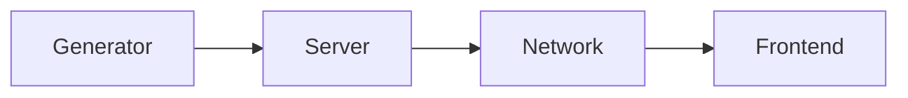

- [Introduction](#introduction)
  - [Who needs web maps?](#who-needs-web-maps)
  - [What are Slippy Maps?](#what-are-slippy-maps)
  - [Why is there no simple solution?](#why-is-there-no-simple-solution)
  - [How does VersaTiles tackle the problem?](#how-does-versatiles-tackle-the-problem)
- [VersaTiles Layer Specification](#versatiles-layer-specification)
  - [Layer: Generator](#layer-generator)
  - [Interface: Container](#interface-container)
  - [Layer: Server](#layer-server)
  - [Interface: Private/Internal Network](#interface-privateinternal-network)
  - [Layer: Network](#layer-network)
  - [Interface: Public/External Network](#interface-publicexternal-network)
  - [Layer: Frontend](#layer-frontend)
- [VersaTiles Frontend Specifications](#versatiles-frontend-specifications)
  - [Folder `/assets/fonts/`](#folder-assetsfonts)
  - [File `/assets/fonts/fonts.json`](#file-assetsfontsfontsjson)
  - [File `/assets/fonts/font_families.json`](#file-assetsfontsfont_familiesjson)
- [Tools](#tools)
- [versatiles.org](#versatilesorg)
- [Show cases](#show-cases)
- [The Future of VersaTiles](#the-future-of-versatiles)
  - [Core Values](#core-values)
  - [Support](#support)
  - [Legal Entity](#legal-entity)


# Introduction

Since the early 1990s, the web has undergone significant technological advancements. New standards and tools have simplified the process of publishing text, articles, photos, videos, and other forms of media. However, publishing maps remains notably challenging - even in the era of mobile web and data journalism.

Several factors contribute to these challenges:
1. Geographic data, satellite imagery and aerial photography, is often protected by copyright, making it expensive and inaccessible for open use.   
Some governments have not yet adopted the idea of open data but insteas produce geospatial data mainly for commercial purposes.
2. Presenting map data on the web in an interactive format can be complex due to various factors such as data formats, geographic projections, server infrastructure requirements, and the intricacies of frontend frameworks. This complexity can make map integration expensive and technically demanding.

Despite theses challenges, the abundance of available data, standards, and frameworks - many of which are open or freely accessible - presents a unique opportunity to build a web map infrastructures. However, the diversity of solutions makes it difficult to put the pieces together.

VersaTiles aims to define and implement a standardised map infrastructure that provides a streamlined approach to integrating maps into web platforms.


## Who needs web maps?

Basically everyone and everything has a geo-coordinate. Even you have a geo-coordinate right now. No data is more useful than geo data, and no visualisation is more familiar than maps.

- **Data Journalism**: Journalists and media outlets often rely on maps to tell stories more effectively, providing readers with a visual context for complex issues such as war zones, political events or natural disasters.
- **Research**: Researchers focusing on environmental issues, climate change or other localised phenomena need a tool to analyse and visualise their data.
- **Emergency Response**: In times of crisis, such as natural disasters or public health emergencies, organisations need maps to visualise affected areas and communicate local information to the public.
- **Communities**: There are so many great communities out there, such as citizen science, community-based bike sharing or community-supported agriculture. They all need a simple, cost-effective way to display location information.


## What are Slippy Maps?

One of the most successful approaches for publishing interactive web maps is called 'slippy maps'. ([Wikipedia](https://en.wikipedia.org/wiki/Tiled_web_map), [OSM Wiki](https://wiki.openstreetmap.org/wiki/Slippy_map))

The first step involves projecting all geographic data onto a 2D plane using the Mercator projection. The Mercator projection has limitations. For instance, it cannot represent the North and South Poles, and objects near the equator, such as Africa, appear smaller than those near the poles, such as Greenland. Nevertheless, the Mercator projection has a significant advantage: it always shows north as up, west as left, and does not distort areas the size of a city. This makes it an excellent option for publishing a global map that can be easily zoomed in and out, displaying every location accurately.

Once all geographic data and/or images have been projected onto a global map, the challenge is to present this information on a web frontend without the need to download large amounts of data. The solution provided by 'slippy maps' is to create a square map of the world at a very low resolution (zoom level 0). To increase the resolution at zoom level 1, the 'world map' is doubled in resolution and divided into four squares (northwest, northeast, southwest, southeast). Zoom level 2 consists of 16 tiles, each with four times the resolution of the world map, and so on.

The tiles can be stored as JPEG images with a resolution of 256x256 pixels. There is a [standard way to name these files](https://wiki.openstreetmap.org/wiki/Slippy_map_tilenames), typically in the format: `{zoom_level}/{column}/{row}.jpg`.

A frontend such as MapLibre, Leaflet or OpenLayers can then load the relevant tiles and display them in the correct position, creating the illusion of a continuous map that can be zoomed and dragged to any position.

This approach works great for image tiles, such as satellite and aerial images. However, it has some disadvantages when displaying [thematic maps](https://en.wikipedia.org/wiki/Thematic_map), such as city maps. When zooming in, the map has to transition from one zoom level to another, resulting in disappearing and reappearing labels. Image tiles do not provide a smooth zooming experience.

Therefore, the concept of 'slippy maps' was improved by including vector data instead of images. [Vector tiles](https://wiki.openstreetmap.org/wiki/Vector_tiles) can store points, paths, polygons, and text - like SVG. But since SVG is too cumbersome, Mapbox developed a [vector tiles standard](https://docs.mapbox.com/data/tilesets/guides/vector-tiles-standards) that stores geographic data as Google Protobufs (PBF). The frontend should read the geographic data and draw it accordingly. One benefit is the ability to define the map style in the frontend, allowing for adjustments to be made to the map's brightness, saturation, and color. Rendering all geographic data can be complex, so vector tiles are typically rendered on the GPU using libraries such as WebGL, OpenGL, or Vulcan to ensure speed and responsiveness.


## Why is there no simple solution?

Generating, serving, and visualizing map tiles can be a complex process due to various tile formats, hosting options, storage and generation methods, serving and display techniques, vector data styling approaches, and data source combinations. Additionally, frontends must draw vector data, satellite images, hillshading, data visualization layers, and interactive frontend elements.

Mapbox aims to address these challenges by providing a comprehensive software suite. However, the solution can be expensive, leads to vendor lock-in, and raises privacy concerns.

It would be ideal to have an open-source system. Although open-source alternatives exist for each problem, integrating them into one infrastructure can be challenging. Developing a single software solution that addresses all problems at once and remains flexible enough for various use cases is not feasible.


## How does VersaTiles tackle the problem?

The development of a solution to address such a broad range of issues was inspired by the creation of the internet itself. Instead of creating a single software to run the entire internet, the OSI model was developed. This model segments the problem into manageable pieces and establishes standards for each component. This segmentation ensures that individual software solutions can be developed independently while remaining compatible with others adhering to OSI standards.

Using the OSI model as a blueprint, we divided the complex problem into smaller, more manageable parts. This allowed us to standardize each segment and their interconnections, ensuring cohesion across all components.

The 'big problem' was conceptualized as a pipeline that generates, serves, and displays map data. We divided the pipeline into four sub-segments and developed specifications to define the interfaces between them. Additionally, we provide free reference implementations for each segment, as well as a reference pipeline that is available for everyone to use at no cost.

This allows anyone to use our map tile service for free or use parts or the entire pipeline on their own infrastructure. VersaTiles permits deviation from the reference pipeline at any point, while still allowing the use of all other pipeline components. This flexibility promotes experimentation and the discovery of new use cases that have not yet been envisioned.

Our reference pipeline is comprised of four segments:



1. **Generator:** Creates map tiles from a data source, such as vector tiles from OpenStreetMap data or image tiles from satellite or aerial photos.
2. **Server:** Manages the storage and distribution of map tiles.
3. **Network:** Handles all network-related issues, including TLS certificates, load balancing and caching.
4. **Frontend:** Provides the user interface for interactive maps.

> [!WARNING] VersaTiles is still in development.
Please note that not all pipeline specifications are final and we may encounter unforeseen use cases, issues or features that require minor adjustments. However, the majority of the pipeline is stable.


# VersaTiles Layer Specification

## Layer: Generator

The Generator Layer produces map tiles, which can be image or vector tiles.

We chose not to use the [OpenMapTiles schema](https://openmaptiles.org/schema/) for vector tiles because we believe it does not embody the openness we aim for. Specifically, the requirement to include links to MapTiler's website or to pay licensing fees seems more like a marketing strategy than a commitment to open standards. Instead, we have opted to utilise the free [Shortbread schema](https://shortbread-tiles.org), which was originally developed by GeoFabrik. We acknowledge that this choice has implications, such as the incompatibility of map styles designed for OpenMapTiles vs. Shortbread. 

However, if we start from scratch, let's do it right from the beginning.

While users are free to deviate from our recommendations and use the OpenMapTiles schema, we will continue to concentrate our efforts on the Shortbread schema.

Users can bypass the tile generation process entirely and download our prepared map tiles covering the entire planet directly from [download.versatiles.org](https://download.versatiles.org).


### Requirements/Recommendations

- Tiles SHOULD be packaged in a [*.versatiles containers](https://github.com/versatiles-org/versatiles-spec/blob/v02/v02/container/readme.md).
- Vector tiles SHOULD conform to the [Shortbread schema](https://shortbread-tiles.org/).
- Containers SHOULD include detailed metadata compliant with [TileJSON 3.0.0](https://github.com/mapbox/tilejson-spec/tree/master/3.0.0), specifically:
  - `attribution` detailing source data copyrights.
  - `vector_layers` describing the vector tiles' layered composition.
- You SHOULD use optimal compression techniques to efficiently reduce tile size without compromising data integrity. Recommended methods include:
  - use Brotli compression for vector tiles.
  - use WebP format for raster tiles to improve loading efficiency and reduce bandwidth.
- The filename of the container SHOULD follow the format `<content>[.<schema>][.<coverage>][.<date>].versatiles` where:
  - `<content>` describes the content, e.g.: `osm`, `hillshade` or `satellite`.
  - `<schema>` (optional) e.g.: `shortbread` or `openmaptiles`.
  - `<coverage>` (optional) specifies the geographical coverage, if not planet wide, e.g.: `europe` or `cairo`.
  - `<date>` (optional) is a [basic ISO date](https://en.wikipedia.org/wiki/ISO_8601#Calendar_dates) (YYYYMMDD), e.g.: `20231231`.


### Status

- [x] Implement Generator using Tilemaker ([repo](https://github.com/versatiles-org/shortbread-tilemaker))
- [x] Use Shortbread schema ([repo](https://github.com/versatiles-org/shortbread-tilemaker))
- [ ] add more languages besides local language, english and german ([issue](https://github.com/shortbread-tiles/shortbread-docs/issues/22))
- [x] generate `.versatiles` instead of `.mbtiles` ([repo](https://github.com/versatiles-org/versatiles-converter))
- [x] merge the Converter into the Generator and use Docker ([issue](https://github.com/versatiles-org/versatiles-generator/issues/1))
- [x] use Tilemaker 3.0.0 to reduce the memory requirements ([issue](https://github.com/versatiles-org/shortbread-tilemaker/issues/7))
- [x] migrate to cheaper Cloud provider (like Hetzner)
- [ ] reduce size of vector tiles ([issue](https://github.com/versatiles-org/versatiles-generator/issues/7))
- [ ] improve lower zoom levels ([issue](https://github.com/versatiles-org/versatiles-generator/issues/2))
- [ ] generate hill shading ([issue](https://registry.opendata.aws/terrain-tiles/))
- [ ] generate satellite imagery (using Landsat/SENTINEL, aerial photos from national open data platforms and open MAXAR images)


## Interface: Container

A frequently asked question is why we chose to develop our own container format. The reasons are manifold:

A critical need within the OSM community is for map tile servers to automatically and rapidly reflect updates to OSM data. While this real-time updating is vital for some OSM contributors, it is not as crucial for a broader audience. News organizations, data journalists, NGOs, and many frontend developers often require only a basic map background that may be a few months old. The need to monitor real-time changes or use map tiles for car navigation is not a priority for these users. However, the insistence on up-to-the-minute updates adds significant complexity and resource demands, necessitating the storage and indexing of all OSM objects in a PostgreSQL/PostGIS database and updating all altered tiles instantaneously. Generating vector tiles directly from a PostgreSQL database is still experimental ([osm2pgsql](https://osm2pgsql.org/examples/vector-tiles/)). These requirements complicate the development of simple, low-cost solutions, leading us to prioritize pre-generated tiles stored in a file container.

The most commonly used container format is [MBTiles](https://wiki.openstreetmap.org/wiki/MBTiles), essentially a SQLite database housing a row for each tile with tile data stored as gzipped blobs. Despite its flexibility, MBTiles has several downsides:
1. It necessitates local or mounted server storage and cannot be hosted on remote cloud storage.
2. SQLite becomes a required dependency. (like libsqlite3-dev)
3. Processing numerous tiles is inefficient, given SQLite's limited throughput capacity.

In response, some have turned to cloud-optimized map tile container formats like [COMTiles](https://github.com/mactrem/com-tiles) or [PMTiles](https://github.com/protomaps/PMTiles), which consolidate tiles into a single file with an appended index for byte-range lookups of each tile. These formats are tailored for distinct use cases; for example, PMTiles is designed for storage on public cloud services like AWS S3 and can be accessed serverlessly through JavaScript via HTTP range requests. While the concept of serverless tile hosting is innovative, it has notable drawbacks such as slow initialization, uncompressed tile data, and caching challenges. Our goal is to remain independent from container formats confined to specific applications or prone to divergent future development paths.

Accordingly, we have drawn insights from COMTiles and PMTiles to create a uniquely straightforward container format detailed here: [VersaTiles Container Specification](https://github.com/versatiles-org/versatiles-spec/blob/main/v02/readme.md).

A distinctive feature of our format is the capability of fast spatial queries running remotely. Users needing only a specific region, such as a continent, country, or city, can forego downloading the entire dataset. Instead, they can use our Rust tool to filter and convert the remote container at [download.versatiles.org](https://download.versatiles.org) and download only an extract, for example:
```bash
versatiles convert --bbox "5,45,10,48" https://download.versatiles.org/osm.versatiles switzerland.versatiles
```
HTTP requests for sequential tiles are merged to download thousands of tiles at once, resulting in a very high performance. This allows for extracting parts of the planet with no overhead. For more information, refer to: https://github.com/versatiles-org/versatiles-documentation/blob/main/guides/download_tiles.md#partial-download. The speed of downloading parts of the world is limited only by the internet connection.


### Requirements/Recommendations

- a container MUST follow the VersaTiles container specification: [VersaTiles Spec](https://github.com/versatiles-org/versatiles-spec/blob/main/v02/readme.md).
- tile data SHOULD use optimal compression


### Status

- [x] Metadata inclusion
- [x] Support for all tile formats (image and vector data)
- [x] Support for all compression methods (gzip, brotli)
- [x] Enablement of bbox downloads
- [x] Completion of the [specification](https://github.com/versatiles-org/versatiles-spec/blob/main/v02/readme.md)


## Layer: Server

The server delivers map tiles and static files via HTTP. These static files may include styles, sprites, fonts, JavaScript libraries, and others.


### Requirements/Recommendations

- It MUST recognize and process [VersaTiles containers](https://github.com/versatiles-org/versatiles-spec/blob/v02/v02/container/readme.md).
- SHOULD handle HTTP header, specifically:
	- `Content-Type` must accurately represent the MIME type.
	- `Accept-Encoding` and `Content-Encoding` for data compression; re-compress data as necessary.
	- `Cache-Control` should be used to manage caching strategies for proxies, CDNs, and browsers. Should include `no-transform`.
	- `Vary` should be set to `Accept-Encoding`.
	- Implement CORS headers, like `Access-Control-Allow-Origin`, as needed.
- The server should be aware of its public URL for referencing resources.
- Organized tile and metadata access through a structured folder hierarchy is recommended:
  - `/tiles/`: The primary directory for tile retrieval.
    - `/tiles/sources.json`: A detailed index of available tile sources.
    - `/tiles/{name}/{z}/{x}/{y}`: Standardized endpoints for tile access.
    - `/tiles/{name}/tiles.json`: a valid [TileJSON 3.0.0](https://github.com/mapbox/tilejson-spec/tree/master/3.0.0).
  - `/assets/`: Houses additional resources like sprites, fonts, styles, and MapLibre GL JS files.
    - `/assets/sprites/`
    - `/assets/fonts/` ([see requirements](#folder-assetsfonts))
    - `/assets/styles/`
    - `/assets/maplibre-gl/maplibre-gl.*`: Contains the latest JavaScript and CSS from MapLibre GL JS.
- SHOULD be configured via `config.yaml` for a tailored server setup, encompassing domain setup, IP/port listening preferences, operational modes (development vs. production), tile source specification, and static content management:

```yaml
server:
  host: '0.0.0.0'  # Listen on all network interfaces. Default: 0.0.0.0
  port: 3000       # Port number for the server. Default: 8080
  domain: 'https://example.org'  # Publicly accessible URL of the server

# Performance settings: Use minimal recompression for development
fast: true  # Set to false in production for full compression. Default: false

# Configuration for tile sources
tile_sources:
  - name: 'osm'
    source: './osm.versatiles'  # Local source for OpenStreetMap tiles
  - name: 'landsat'
    source: 'https://example.org/landsat.versatiles'  # Remote source for Landsat tiles

# Optional configuration for serving static content
static_content:
  - source: './styles'
    prefix: 'assets/styles'  # URL path prefix for styles
  - source: './frontend.tar'
    # Default prefix is "/"

cors:
  # Default policy to allow or block CORS requests if they don't match any specific rules
  default_policy: 'block'  # Options: 'allow', 'block'

  # List of URL patterns to explicitly allow for CORS requests
  allow_patterns:
    - '^https?://trusteddomain\.com'
    - '^https?://*.example\.com'

  # List of URL patterns to explicitly block for CORS requests
  block_patterns:
    - '^https?://untrusteddomain\.com'
    - '^https?://*.malicious\.com'

logging:
  level: 'info'  # Options: 'debug', 'info', 'warning', 'error'
  path: '/var/log/myserver.log'  # File path for log output
```

### Rust Implementation

We offer a high-performance [Rust implementation](https://github.com/versatiles-org/versatiles-rs), available both as a CLI application and as Rust library (crate).

Supported platforms include x86 and ARM (64 Bit) across:
- [x] Linux
- [x] MacOS
- [ ] Windows

In addition to source code, which can be [compiled using cargo](https://github.com/versatiles-org/versatiles-documentation/blob/main/guides/install_versatiles.md#building-from-source), we provide:
- [x] [Binary releases](https://github.com/versatiles-org/versatiles-rs/releases) via GitHub
- [ ] NixOS
- [ ] Snap
- [ ] Flatpak
- [x] [Homebrew](https://github.com/versatiles-org/homebrew-versatiles)

Our [Docker images](https://hub.docker.com/u/versatiles) ([Repository](https://github.com/versatiles-org/versatiles-docker)) use Debian, Alpine, and scratch environments. They including variations without and with [all static frontend files](https://hub.docker.com/r/versatiles/versatiles-frontend/tags).

Future enhancements will focus on:
- [ ] Proper CORS handling
- [ ] Full `config.yaml` support
- [ ] Tile size statistics generation
- [ ] Vector tile content debugging
- [ ] Implementing "diff" and "patch" commands for tile updates
- [ ] Developing an "overlay" command for image tile layering
- [ ] improve the "overlay" command by implementing a [multi-scale approach](https://en.wikipedia.org/wiki/Multi-scale_approaches) to seamlessly overlay image tiles (see also [Gradient-domain image processing](https://en.wikipedia.org/wiki/Gradient-domain_image_processing))


### NodeJS Implementations

Our NodeJS offerings include:
- [x] An [NPM library](https://github.com/versatiles-org/node-versatiles-container)
- [x] A basic [server](https://github.com/versatiles-org/node-versatiles-server)
- [ ] Full `config.yaml` support
- [ ] Comprehensive CORS management

A specialized solution for data journalists using Google Cloud involves a NodeJS Cloud Run server that serves static files from a bucket via CDN, managing all HTTP headers, MIME types, caching, and optimal compression. A standout feature is serving tiles directly from a `*.versatiles` file, including a preview mode:
- [x] [Google Cloud Run server](https://github.com/versatiles-org/node-versatiles-google-cloud) simplifies map data integration into data visualizations for editorial departments.


### Status

Moving forward, we aim to:
- [ ] Validate VersaTiles on Raspberry Pi for accessibility in unique scenarios
- [ ] Explore a tile server on ESP32, showcasing the simplicity and efficiency of VersaTiles
- [ ] Standardize server configuration and API for seamless transitions between server implementations


## Interface: Private/Internal Network

This interface is where the server processes HTTP requests. It is advised against incorporating additional functionalities, such as TLS, directly into the server layer to maintain simplicity. Instead, these network-related features should be managed by the network layer, ensuring a clear separation of concerns.


## Layer: Network

The Network Layer is crucial for serving files over the public internet, addressing all related security, availability, and performance requirements.


### Requirements/Recommendations

- **Transport Layer Security (TLS)**: Implement TLS to secure communications with certificates management.
- **Security Measures**: Protect against DDoS attacks and other security threats to maintain service integrity.
- **Availability**: Use load balancing techniques to distribute traffic evenly across servers.
- **Performance**: Employ Content Delivery Networks (CDN) to accelerate content delivery and reduce latency.
- **Compliance and Best Practices**: Adhere to industry standards and best practices for network security and performance.


### Status

Efforts have been made to evaluate and document CDN solutions, with a focus on integration, performance and price estimates:

- [x] ✅ Google CDN (80€/TB): Tested and used at SWR.
- [x] ✅ NGINX: could be standard solution for single server setups
- [x] 🟨 [Bunny CDN](https://bunny.net/cdn/) (5€/TB): Tested for [tiles.versatiles.org](https://tiles.versatiles.org). Unfortunately, BunnyCDN is currently unable to fetch or return compressed vector tiles. The headers "content-encoding" and "vary: accept-encoding" are ignored. The CDN engineering team has been informed, but there is no ETA.
- [ ] [Akamai CDN](https://www.akamai.com/): not tested yet
- [ ] [Amazon CloudFront](https://aws.amazon.com/cloudfront) (90€/TB): not tested yet
- [ ] [BlazingCDN](https://blazingcdn.com) (5€/TB): not tested yet
- [ ] [Cachefly](https://www.cachefly.com/) (30$/TB, min. 300€/month): not tested yet
- [ ] [CDN77](https://www.cdn77.com/) (4\$/TB, min. 990\$/month): not tested yet
- [ ] [CDNetworks](https://www.cdnetworks.com/) (40\$/TB, min. 50\$/month): not tested yet
- [ ] [Cloudflare CDN](https://www.cloudflare.com/en-gb/application-services/products/cdn/) (0$/TB, minimum costs: your soul): not tested yet
- [ ] [Edgecast CDN](https://edg.io/applications/performance/): not tested yet
- [ ] [EdgeNext](https://www.edgenext.com/cdn/): not tested yet
- [ ] [Fastly CDN](https://www.fastly.com/) (130$/TB): not tested yet
- [ ] [KeyCDN](https://www.keycdn.com/) (40$/TB): not tested yet
- [ ] [Leaseweb](https://www.leaseweb.us/) (7$/TB, min. 150€/month): not tested yet
- [ ] [Medianova CDN](https://www.medianova.com/cdn/) (200\$/TB, min. 100\$/month): not tested yet
- [ ] [Microsoft Azure CDN](https://azure.microsoft.com/en-us/products/cdn) (75$/TB): not tested yet
- [ ] [OHV CDN](https://www.ovhcloud.com/en-gb/network/cdn/) (12€/TB, prepaid): not tested yet

Documentation on the use of NGINX, including setup and configuration for optimal performance, is in development.


## Interface: Public/External Network

This interface represents the network's public-facing aspect, which is responsible for handling incoming and outgoing traffic to the internet.


## Layer: Frontend

The Frontend Layer serves as the graphical interface, presenting map tiles to the user. While numerous frameworks such as MapLibre GL JS, Mapbox, OpenLayers, and Leaflet are available for this purpose, our focus is on MapLibre. This choice is due to MapLibre's ability to efficiently render vector tiles on the GPU, its open-source licensing, and its comprehensive support for JavaScript, iOS, and Android platforms.


### Requirements/Recommendations

- The frontend SHOULD be compatible with both vector and raster tiles.


### Status

Progress in the development and implementation of the Frontend Layer includes:

- [x] **Style Templating Engine**: Implemented to allow dynamic generaton of map styles. ([Repository](https://github.com/versatiles-org/versatiles-style))
- [x] **Style Library**: A collection of pre-defined map styles is available. ([Repository](https://github.com/versatiles-org/versatiles-style))
- [x] **Fonts**: Prepared standard fonts. ([Repository](https://github.com/versatiles-org/versatiles-fonts))
- [x] **Sprites Using Signed Distance Fields**: ... to ensure icons and symbols are scalable, colourable and clear at any zoom level. ([Repository](https://github.com/versatiles-org/versatiles-style))
- [ ] **Multiple Frontends** are available: a minimal version and a big developer version ([Repository](https://github.com/versatiles-org/versatiles-frontend))
- [ ] **Right-to-Left (RTL) Label Support**: Efforts are underway to include support for RTL languages, such as Arabic, to ensure maps are accessible for a global audience. ([issue](https://github.com/versatiles-org/versatiles-frontend/issues/15))


# VersaTiles Frontend Specifications


## Folder `/assets/fonts/`

- When serving a frontend, the fonts should be stored in `/assets/fonts/`.
- The glyphs should be served as `/assets/fonts/{fontname}/{start}-{end}.pbf`, e.g. `/assets/fonts/open_sans_bold_italic/768-1023.pbf`.
- Font names (`{fontname}`) SHOULD be OS/UNIX/URL safe and therefore contain only lower case letters, digits and underscores. Instead of naming fonts like `Arial%20Unicode%20MS%20Regular`, the name should be `arial_unicode_ms_regular`.
- You should also serve a list of all available fonts as [`fonts.json`](#file-assetsfontsfontsjson) and [`font_families.json`](#file-assetsfontsfont_familiesjson).


## File `/assets/fonts/fonts.json`

There should be JSON at `/assets/fonts/fonts.json` containing an array of all folders in `/assets/fonts/` containings glyphs.

For example:
```JSON
[
  "fira_sans_bold",
  "fira_sans_bold_italic",
  "fira_sans_condensed_bold",
  "fira_sans_condensed_bold_italic",
  "fira_sans_condensed_italic",
  "fira_sans_condensed_regular",
  "fira_sans_italic",
  "fira_sans_regular"
]
```


## File `/assets/fonts/font_families.json`

There should be JSON at `/assets/fonts/font_families.json` containing all font families with their font faces. The keys of the `fontFace` objects should be the same as the glyph folder names.

The TypeScript definition of this JSON is:
```TypeScript
type FontFamilies = Record<string, FontFamily>;
interface FontFamily {
  name: string;
  fontFace: Record<string, FontFace>;
}
interface FontFace {
  name: string;
  italic: boolean;
  weight: 100 | 200 | 300 | 400 | 500 | 600 | 700 | 800 | 900;
}
```

For example:
```JSON
{
  "fira_sans": {
    "name": "Fira Sans",
    "fontFace": {
      "fira_sans_bold": { "name": "Bold", "italic": false, "weight": 700 },
      "fira_sans_bold_italic": { "name": "Bold Italic", "italic": true, "weight": 700 },
      "fira_sans_italic": { "name": "Italic", "italic": true, "weight": 400 },
      "fira_sans_regular": { "name": "Regular", "italic": false, "weight": 400 }
    }
  },
    "fira_sans_condensed": {
    "name": "Fira Sans Condensed",
    "fontFace": {
      "fira_sans_condensed_bold": { "name": "Bold", "italic": false, "weight": 700 },
      "fira_sans_condensed_bold_italic": { "name": "Bold Italic", "italic": true, "weight": 700 },
      "fira_sans_condensed_italic": { "name": "Italic", "italic": true, "weight": 400 },
      "fira_sans_condensed_regular": { "name": "Regular", "italic": false, "weight": 400 }
    }
  }
}
```

Based on this example JSON the following glyphs should be available:
```
/assets/fonts/fira_sans_bold/*.pbf
/assets/fonts/fira_sans_bold_italic/*.pbf
/assets/fonts/fira_sans_italic/*.pbf
/assets/fonts/fira_sans_regular/*.pbf
/assets/fonts/fira_sans_condensed_bold/*.pbf
/assets/fonts/fira_sans_condensed_bold_italic/*.pbf
/assets/fonts/fira_sans_condensed_italic/*.pbf
/assets/fonts/fira_sans_condensed_regular/*.pbf
```

# Tools

In our roadmap, we plan to develop a suite of useful tools aimed at enhancing the usability and functionality of web-based mapping solutions:

- [ ] **Editorial Tools**: A comprehensive suite of web-based tools designed specifically for newsrooms, enabling the quick creation of:
  - [ ] **Locator Map**: A streamlined tool for generating maps that pinpoint a single location with customizable labeling. Ideal for illustrating the site of local events such as demonstrations, emergencies, or incidents.
  - [ ] **Area Map**: Facilitates the creation of maps delineating areas with additional symbols (e.g., arrows) and annotations. This tool is particularly useful for visualizing large-scale impacts, such as restricted zones, areas affected by natural disasters, or military front lines.
  - [ ] **Points Map**: A utility for plotting numerous points on a map, sourced from data files (CSV, Excel) containing geocoordinates or addresses. Applications include mapping incidents like bicycle accidents, showcasing locations of interest such as Christmas markets, or indicating facilities like COVID-19 testing centers.
- [ ] **GeoJSON BBOX Tool**: A user-friendly web tool for selecting a bounding box (bbox) on a map and exporting the coordinates in various formats, simplifying the process of defining map extents.
- [ ] **Installer**: An web tool that provides customized installation instructions for setting up a map server for a selected region, tailored for multiple platforms like Linux, macOS, Raspberry Pi and more.
- [ ] **Style-Maker**: A plugin for MapLibre designed to facilitate the customization of map styles, allowing users to modify colors, fonts, and language settings seamlessly. ([Repository](https://github.com/versatiles-org/maplibre-versatiles-styler))
- [ ] **Backend Renderer**: A JavaScript library engineered to render specified map regions into PNG or SVG formats, offering a flexible solution for static map generation. ([Repository](https://github.com/versatiles-org/versatiles-renderer))
- [ ] **VersaTiles-Studio**: A desktop application, developed in Rust, that enables the conversion of geographic data into vector tiles while optimizing tile size.
- [ ] **Generate City Maps**: An interactive web demonstration of VersaTiles capabilities, allowing users to select a region and automatically generate a stylized city map poster in black and white. ([Examples](https://duckduckgo.com/?va=i&t=hb&q=city+map+poster&iax=images&ia=images))
- [ ] **Style Converter**: A NodeJS utility designed to convert map styles from the OpenMapTiles schema to the Shortbread schema.


# versatiles.org

The website needs to be developed further:
- [ ] migrate download.versatiles.org to new V-Server
- [x] migrate tiles.versatiles.org to new V-Server
- [ ] add to versatiles.org:
  - [ ] documentation
  - [ ] tutorials
  - [ ] specification
  - [ ] exmaples
  - [ ] show cases
  - [ ] tools


# Show cases

- https://www.swr.de/swraktuell/diesel-und-benzinpreise-aktuell-so-tanken-sie-heute-clever-100.html
- https://www.swr.de/swraktuell/rheinland-pfalz/waldbraende-aktuell-orte-karte-rlp-102.html
- https://swrdata.github.io/zensus-gitter-test/
- https://taz.de/Deutsche-Vorschriften-fuer-Windenergie/!5901969/
- https://interaktiv.morgenpost.de/cannabis-legalisierung-kiffen-karte/
- https://www.ndr.de/nachrichten/hamburg/Neue-Studie-Hamburg-bleibt-Deutschlands-Stau-Hochburg,stau1650.html
- https://www.ndr.de/nachrichten/hamburg/Zensus-2022-Hamburg-ist-Bundesland-mit-hoechsten-Mieten,zensus340.html
- https://www.ndr.de/nachrichten/ndrdata/Zensus-Mietpreise-im-Norden-im-Ueberblick,zensus308.html


# The Future of VersaTiles

VersaTiles aims to democratize map data and tools, making geographic information accessible to all. Its future direction is guided by core principles, sustainable funding avenues, and a legal framework that supports its growth and mission.


## Core Values

The ethos of VersaTiles is based on the principles of openness and freedom, with a focus on empowering users and contributors. We believe in the power of open source software to drive collaboration and innovation.

This is achieved through:
- **Open Standards**: We promote openly documented protocols and formats to encourage interoperability and flexibility in mapping solutions.
- **Open Data**: We advocate for free access to geographic data and support initiatives that encourage information sharing to enrich public knowledge and innovation.
- **Open Source**: By developing VersaTiles in an open environment, we encourage collaboration, auditability, and adoption, fostering a diverse ecosystem of applications and users.
- **Prefer Free Over Open**: We prioritize free standards, data, and software whenever possible, in line with our commitment to accessibility.


## Support

Maintaining the non-commercial ethos of VersaTiles while supporting ongoing development and infrastructure poses unique challenges. 
To address these challenges, we are actively seeking grants and forming partnerships to secure financial support for both development and infrastructure maintenance, ensuring the project's long-term viability. Additionally, we encourage the community and beneficiaries of VersaTiles to contribute code.


## Legal Entity

A crucial factor in the future growth of VersaTiles is determining the most appropriate legal entity to handle donations and financial transactions. This decision is essential for establishing a solid foundation for the project and enabling the receipt of donations.

The options being considered include:
- **Independent Entity**: Establishing VersaTiles as a standalone legal entity, providing full autonomy but with the responsibility of full organizational management.
- **Subsection of an Existing Foundation**: Integrating VersaTiles as a subsection within an established foundation, benefiting from existing infrastructures, such as legal and financial frameworks, while focusing on project development.
