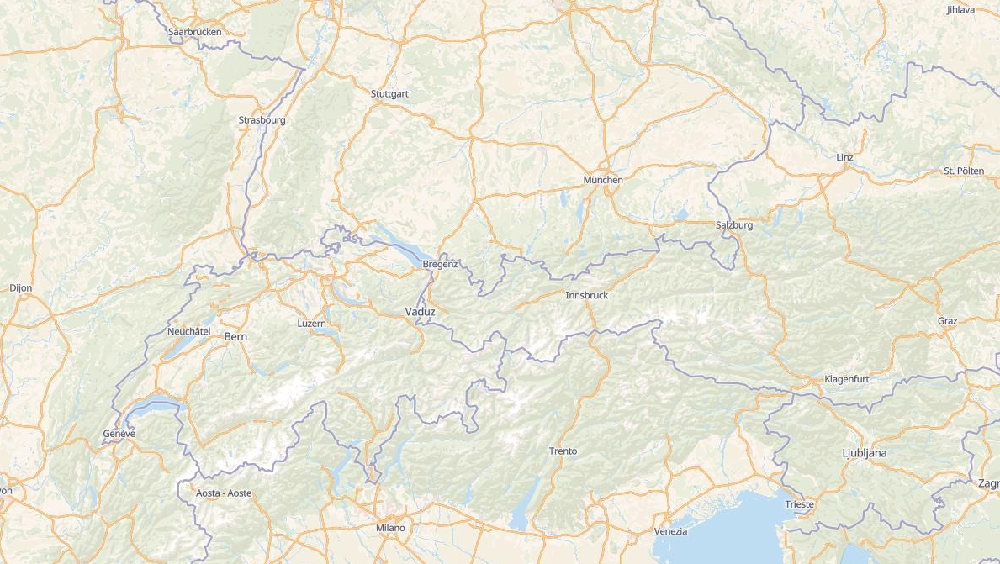
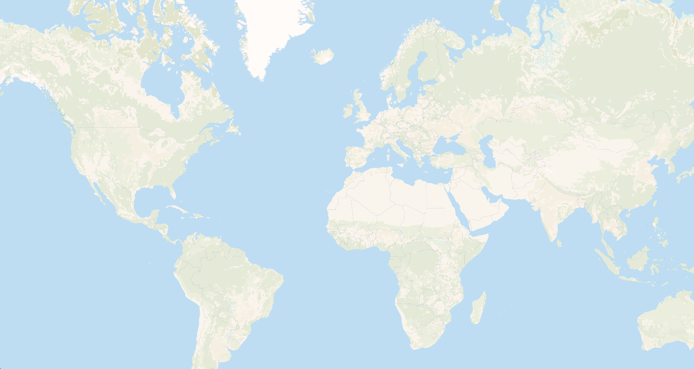
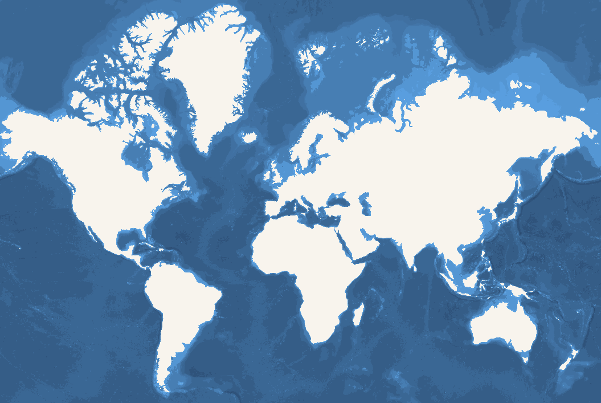

# Tilesets

## OSM Shortbread Vector Tiles


A set of general purpose vector tiles based on [OpenStreetMap](https://www.openstreetmap.org/) data using the [Shortbread Scheme](https://shortbread-tiles.org/schema/).

* [Download](https://download.versatiles.org/osm.versatiles)
* [Repository](https://github.com/versatiles-org/versatiles-generator)

### Style

There are [several ready-made Public Domain styles](https://github.com/versatiles-org/versatiles-style) available.

### License / Attribution

* OpenStreetMap data is licensed under [Open Database License 1.0](https://opendatacommons.org/licenses/odbl/) and requires attribution to [OpenStreetMap contributors](https://www.openstreetmap.org/copyright)
* The Shortbread Scheme [is licensed](https://shortbread-tiles.org/copyright/) under [CC-0](https://shortbread-tiles.org/copyright/CC0-1.0-LICENSE.txt) and does not require additional attribution.


## Hillshade



A set of general purpose vector tiles for simulating a shaded relief. Based on [Mapzen Jörð Terrain Tiles](https://github.com/tilezen/joerd), inspired by [Datawrapper](https://www.datawrapper.de/blog/shaded-relief-with-gdal-python)

* [Download](https://download.versatiles.org/landcover-vectors.versatiles)

### Stlye

There is one layer called `hillshade-vectors` with a property `shade`:

* `light` Light Shades
* `dark` Dark Shades

#### Example

``` js
{
  // ...
  "sources": {
    "versatiles-hillshade": {
      "tilejson": "3.0.0",
      "name": "VersaTiles Hillshade Vectors",
      "description": "VersaTiles Hillshade Vectors based on Mapzen Jörð Terrain Tiles",
      "attribution": "<a href=\"https://github.com/tilezen/joerd/blob/master/docs/attribution.md\">Mapzen Terrain Tiles, DEM Sources</a>",
      "version": "1.0.0",
      "tiles": ["https://tiles.versatiles.org/tiles/hillshade-vectors/{z}/{x}/{y}"],
      "type": "vector",
      "scheme": "xyz",
      "format": "pbf",
      "bounds": [ -180, -85.0511287798066, 180, 85.0511287798066 ],
      "minzoom": 0,
      "maxzoom": 12,
      "vector_layers":[{ "id": "hillshade-vectors", "fields": { "shade": "String" }, "minzoom": 0 ,"maxzoom": 12 }]
    }
  },
  "layers": [
    {
      "id": "hillshade-light",
      "type": "fill",
      "source-layer": "hillshade-vectors",
      "source": "versatiles-hillshade",
      "filter": [ "all", ["==", "shade", "light"] ],
      "paint": {
        "fill-color": "#ffffff",
        "fill-opacity": 1,
        "fill-opacity": { "stops": [[0, 0], [4, 0.2]] },
        "fill-antialias": true,
        "fill-outline-color": "#ffffff00"
      }
    },
    {
      "id": "hillshade-dark",
      "type": "fill",
      "source-layer": "hillshade-vectors",
      "source": "versatiles-hillshade",
      "filter": [ "all", ["==", "shade", "dark"] ],
      "paint": {
        "fill-color": "#000000",
        "fill-opacity": 1,
        "fill-opacity": { "stops": [[0, 0], [4, 0.05]] },
        "fill-antialias": true,
        "fill-outline-color": "#00000000"
      }
    }
  ]
}
```

### License / Attribution

* [Mapzen Jörð Terrain Tiles](https://github.com/tilezen/joerd) ([Access via AWS](https://registry.opendata.aws/terrain-tiles/)) uses variously licensed sources with [attribution requirements](https://github.com/tilezen/joerd/blob/master/docs/attribution.md)
* The VersaTiles Hillshade Vectors tileset is licensed [CC BY 4.0](http://creativecommons.org/licenses/by/4.0/) carrying forward these attribution requirements


## Landcover



A set of vector tiles based on [ESA Worldcover](https://esa-worldcover.org/en/data-access) raster.
They are used to complement OSM tiles on lower zoom levels.

* [Download](https://download.versatiles.org/landcover-vectors.versatiles)
* [Repository](https://github.com/versatiles-org/landcover-vectors)

### Style

There is one layer called `landcover-vectors` with a property `kind`:

* `bare` Bare / sparse vegetation
* `builtup` Built-up
* `cropland` Cropland
* `grassland` Grassland
* `mangroves` Mangroves
* `moss` Moss and lichen
* `shrubland` Shrubland
* `snow` Snow and ice
* `treecover` Tree cover
* `water` Permanent water bodies
* `wetland` Herbaeceous wetland

#### Example

``` js
{
  // ...
  "sources": {
    "versatiles-landcover": {
      "tilejson": "3.0.0",
      "name": "VersaTiles Landcover Vectors",
      "description": "VersaTiles Hillshade Vectors based on ESA Worldcover 2021",
      "attribution": "<a href=\"https://esa-worldcover.org/en/data-access\">© ESA WorldCover project 2021 / Contains modified Copernicus Sentinel data (2021)</a>",
      "version": "1.0.0",
      "tiles": ["https://tiles.versatiles.org/tiles/landcover-vectors/{z}/{x}/{y}"],
      "type": "vector",
      "scheme": "xyz",
      "format": "pbf",
      "bounds": [ -180, -85.0511287798066, 180, 85.0511287798066 ],
      "minzoom": 0,
      "maxzoom": 8,
      "vector_layers":[{ "id": "landcover-vectors", "fields": { "kind": "String" }, "minzoom": 0 ,"maxzoom": 12 }]
    }
  },
  "layers": [
    {
      "id": "landcover-bare",
      "type": "fill",
      "source-layer": "landcover-vectors",
      "source": "versatiles-landcover",
      "filter": [ "all", ["==", "kind", "bare"] ],
      "paint": {
        "fill-color": "#FAFAED",
        "fill-opacity": { "stops": [[0, 0.2], [10, 0.2], [11, 0]] },
        "fill-antialias": true,
        "fill-outline-color": "#ffffff00"
      }
    },
    // ...
  ]
}

```

### License / Attribution

* [ESA Worldcover](https://esa-worldcover.org/en/data-access) is licensed [CC BY 4.0](http://creativecommons.org/licenses/by/4.0/)
* The VersaTiles Landcover Vectors tileset is derived from ESA Worldcover and therefore also licensed [CC BY 4.0](http://creativecommons.org/licenses/by/4.0/)

bathymetry
## Bathymetry



A set of vector tiles based on [Bathymetry Shapefiles from OpenDEM](https://www.opendem.info/download_bathymetry.html)

* [Repository](https://github.com/versatiles-org/opendem-gebco-bathymetry)

### Style

There is one layer called `bathymetry` with a property `mindepth` with values

| Zoom | Depths |
| ---- | ------ |
| 0-5  | 100, 500, 2000, 6000, 8000
| 6-9  | 50, 100, 200, 500, 1000, 1500, 2000, 3000, 4000, 5000, 6000, 7000, 8000, 9000
| 10   | 25, 50, 100, 200, 250, 500, 750, 1000, 1250, 1500, 1750, 2000, 2500, 3000, 3500, 4000, 4500, 5000, 5500, 6000, 6500, 7000, 7500, 8000, 8500, 9000, 9500

#### Example

``` js
{
  // ...
  "sources": {
    "bathymetry-gebco-opendem": {
      "tilejson": "3.0.0",
      "name": "OpenDEM GEBCO Bathymetry",
      "description": "Bathymetry Vectors based on GEBCO 2021 derived contour polys provided by OpenDEM",
      "attribution": "Derived product from the <a href=\"https://www.gebco.net/data_and_products/historical_data_sets/#gebco_2019\">GEBCO 2019 Grid</a>, made with <a href=\"https://www.naturalearthdata.com/\">NaturalEarth</a> by <a href=\"https://opendem.info\">OpenDEM</a>",
      "version": "1.0.0",
      "tiles": ["https://tiles.versatiles.org/tiles/batymetry-vectors/{z}/{x}/{y}"],
      "type": "vector",
      "scheme": "xyz",
      "format": "pbf",
      "bounds": [ -180, -85.0511287798066, 180, 85.0511287798066 ],
      "minzoom": 0,
      "maxzoom": 10,
      "vector_layers":[{ "id": "bathymetry", "fields": { "mindepth": "Number" }, "minzoom": 0 ,"maxzoom": 10 }]
    }
  },
  "layers": [
    {
      "id": "bathymetry-gebco-opendem",
      "type": "fill",
      "source": "bathymetry-gebco-opendem",
      "source-layer": "bathymetry",
      "layout": {
        "visibility": "visible"
      },
      "paint": {
        "fill-opacity": 1,
        "fill-antialias": false,
        "fill-color": ["case",
          ["==", ["get", "mindepth"], -25], "#0084bd",
          ["==", ["get", "mindepth"], -50], "#0181ba",
          ["==", ["get", "mindepth"], -100], "#017fb6",
          ["==", ["get", "mindepth"], -200], "#027cb3",
          ["==", ["get", "mindepth"], -250], "#0279af",
          ["==", ["get", "mindepth"], -500], "#0276ac",
          ["==", ["get", "mindepth"], -750], "#0374a8",
          ["==", ["get", "mindepth"], -1000], "#0371a5",
          ["==", ["get", "mindepth"], -1250], "#036ea1",
          ["==", ["get", "mindepth"], -1500], "#036c9e",
          ["==", ["get", "mindepth"], -1750], "#03699b",
          ["==", ["get", "mindepth"], -2000], "#036797",
          ["==", ["get", "mindepth"], -2500], "#036494",
          ["==", ["get", "mindepth"], -3000], "#036191",
          ["==", ["get", "mindepth"], -3500], "#035f8d",
          ["==", ["get", "mindepth"], -4000], "#035c8a",
          ["==", ["get", "mindepth"], -4500], "#035a87",
          ["==", ["get", "mindepth"], -5000], "#025783",
          ["==", ["get", "mindepth"], -5500], "#025580",
          ["==", ["get", "mindepth"], -6000], "#02527d",
          ["==", ["get", "mindepth"], -6500], "#025079",
          ["==", ["get", "mindepth"], -7000], "#014d76",
          ["==", ["get", "mindepth"], -7500], "#014b73",
          ["==", ["get", "mindepth"], -8000], "#014870",
          ["==", ["get", "mindepth"], -8500], "#01466c",
          ["==", ["get", "mindepth"], -9000], "#004369",
          ["==", ["get", "mindepth"], -9500], "#004166",
          "#0097d6"
        ]
      }
    }
  ]
}

```

### License / Attribution

* The GEBCO Grid is placed in the public domain and may be used free of charge. Use of the GEBCO Grid indicates that the user accepts the [conditions of use and disclaimer information](https://www.gebco.net/data-products/gridded-bathymetry-data/gebco-2021#section8).
* Attribution: Derived product from the [GEBCO 2021 Grid](https://www.gebco.net/data_and_products/historical_data_sets/#gebco_2021), made with [NaturalEarth](https://www.naturalearthdata.com/) by [OpenDEM](https://opendem.info)
