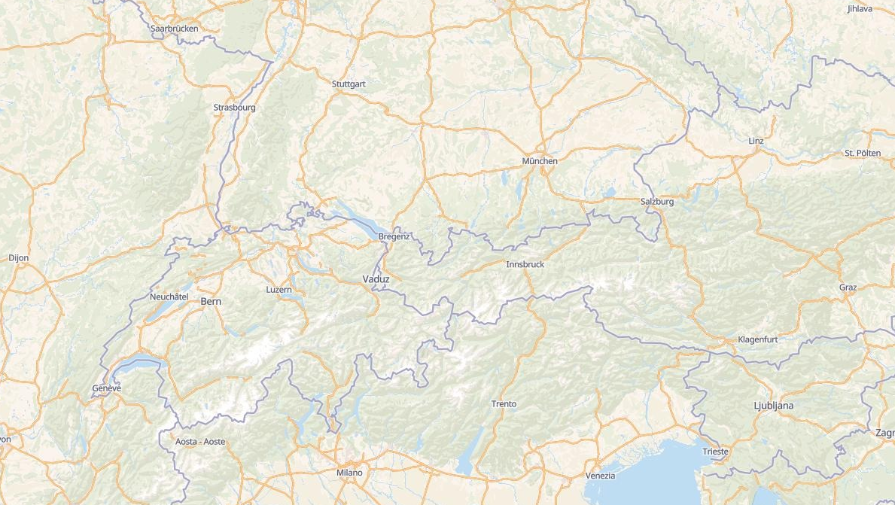
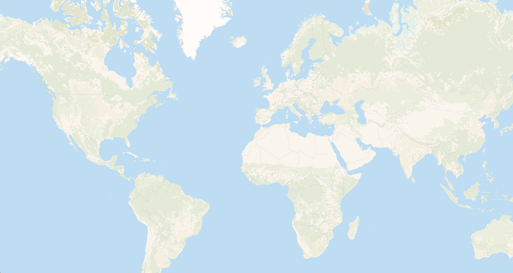
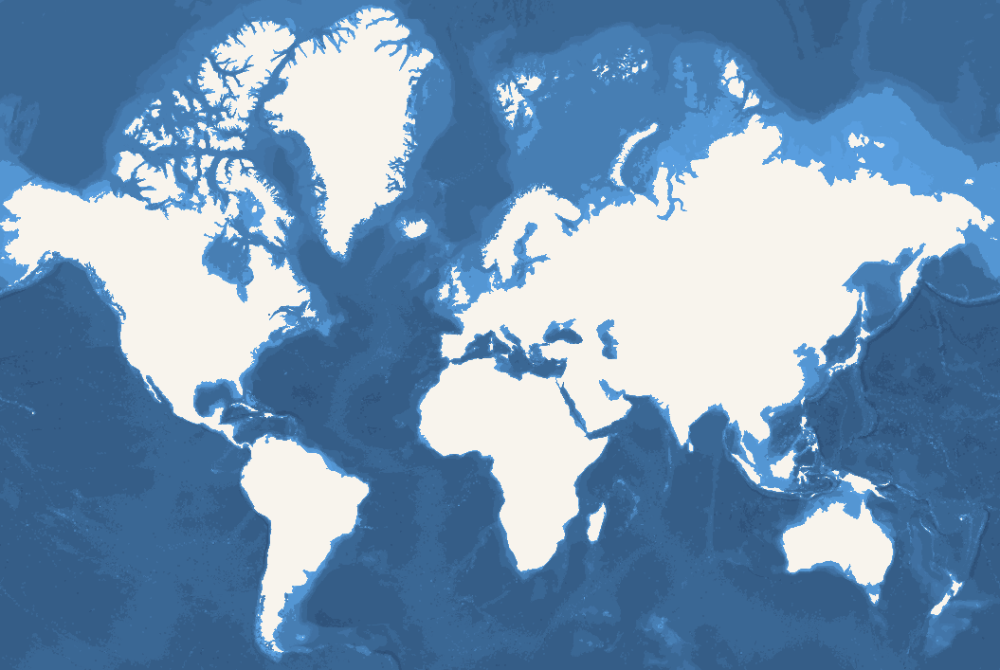
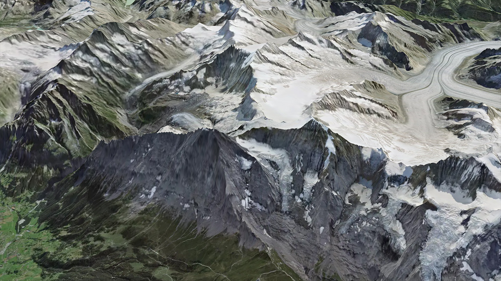

# Tilesets

We prepare and publish a number of ready-to-use tilesets. There are two ways to use them:

- **Download** the [`.versatiles` container](https://github.com/versatiles-org/versatiles-spec/blob/main/v02/readme.md) from [download.versatiles.org](https://download.versatiles.org/) and [serve it yourself](versatiles_server.md).
- **Use our hosted tiles** at `https://tiles.versatiles.org/tiles/<tileset>/{z}/{x}/{y}` for prototyping and small projects. See [Use tiles.versatiles.org](../guides/use_tiles_versatiles_org.md).

| Tileset                                         | Type   | Zoom                           | Download | Maturity | Hosted as            |
| ----------------------------------------------- | ------ | ------------------------------ | -------- | -------- | -------------------- |
| [OSM Shortbread](#osm-shortbread-vector-tiles)  | vector | 0–14                           | 62 GB    | stable   | –                    |
| [OSM + Landcover](#osm-shortbread-vector-tiles) | vector | 0–14                           | 64 GB    | beta     | `osm`                |
| [Hillshade](#hillshade)                         | vector | 0–12                           | 105 GB   | alpha    | `hillshade-vectors`  |
| [Landcover](#landcover)                         | vector | 0–10                           | 1.9 GB   | beta     | –                    |
| [Bathymetry](#bathymetry)                       | vector | 0–10                           | 0.7 GB   | alpha    | `bathymetry-vectors` |
| [Elevation](#elevation)                         | raster | 0–12                           | 407 GB   | beta     | `elevation`          |
| [Satellite](#satellite)                         | raster | 0–12 globally, more regionally | 1.6 TB   | alpha    | `satellite`          |

The hosted `osm` tileset is the merged OSM + Landcover variant. File sizes are approximate and grow over time — [download.versatiles.org](https://download.versatiles.org/) is the authoritative source.

## Getting the containers

Beyond the plain download links below, the download server also offers:

- **Dated snapshots** of the OSM tilesets (e.g. `osm.20260608.versatiles`) next to the always-current `osm.versatiles`, plus an RSS feed per tileset so you can watch for new builds.
- **Format conversion and bounding-box extracts** on the fly: pick `.versatiles`, `.pmtiles`, `.mbtiles` or `.tar` and an area, and the site generates the matching `versatiles convert` or `curl` command for you. A regional extract is usually a few hundred megabytes instead of tens of gigabytes.
- A **URL list** (`urllist_<tileset>.tsv`) per tileset for scripted downloads.

## OSM Shortbread Vector Tiles


A set of general purpose vector tiles based on [OpenStreetMap](https://www.openstreetmap.org/) data using the [Shortbread schema](https://shortbread-tiles.org/schema/1.1/), covering the whole planet from zoom level 0 to 14.

- [Download `osm.versatiles`](https://download.versatiles.org/osm.versatiles) (62 GB) — plain OSM Shortbread
- [Download `osm-landcover.versatiles`](https://download.versatiles.org/osm-landcover.versatiles) (64 GB, beta) — the same tiles pre-merged with [Landcover](#landcover), ready to use without further processing
- [How to generate tiles](../guides/generate_tiles_from_osm.md)

> [!IMPORTANT]
> The hosted tileset at `https://tiles.versatiles.org/tiles/osm/{z}/{x}/{y}` is the **merged** variant: it contains OpenStreetMap **and** landcover data. If you use it, you must also attribute ESA WorldCover — see [Landcover](#landcover) below.

### Style

There are [several ready-made Public Domain styles](https://github.com/versatiles-org/versatiles-style) available.

### Licence & Attribution

- OpenStreetMap data is licensed under [Open Database License 1.0](https://opendatacommons.org/licenses/odbl/) and requires attribution to [OpenStreetMap contributors](https://www.openstreetmap.org/copyright)
- The Shortbread schema [is licensed](https://shortbread-tiles.org/copyright/) under [CC-0](https://shortbread-tiles.org/copyright/CC0-1.0-LICENSE.txt) and does not require additional attribution.
- If you use the merged variant (including the hosted `osm` tileset), add the [Landcover attribution](#landcover) as well.

## Hillshade



A set of general purpose vector tiles for simulating a shaded relief. Based on [Mapzen Jörð Terrain Tiles](https://github.com/tilezen/joerd), inspired by [Datawrapper](https://www.datawrapper.de/blog/shaded-relief-with-gdal-python).

- [Download](https://download.versatiles.org/hillshade-vectors.versatiles) (105 GB, alpha)

> [!TIP]
> Hillshading as vector polygons is cheap to render and works in any MapLibre style, but the container is large and the result is coarse above zoom level 12. If you can afford a `raster-dem` source and the larger download, [Elevation](#elevation) gives you MapLibre's own hillshading _and_ 3D terrain from a single tileset, at any zoom level up to 12.

### Style

There is one layer called `hillshade-vectors` with a property `shade`:

- `light` Light Shades
- `dark` Dark Shades

#### Example

```js
{
  // ...
  "sources": {
    "versatiles-hillshade": {
      "tilejson": "3.0.0",
      "name": "VersaTiles Hillshade Vectors",
      "description": "VersaTiles Hillshade Vectors based on Mapzen Jörð Terrain Tiles",
      "attribution": "<a href=\"https://github.com/tilezen/joerd/blob/master/docs/attribution.md\">Mapzen Terrain Tiles, DEM Sources</a>",
      "tiles": ["https://tiles.versatiles.org/tiles/hillshade-vectors/{z}/{x}/{y}"],
      "type": "vector",
      "scheme": "xyz",
      "format": "pbf",
      "bounds": [ -180, -85.0511287798066, 180, 85.0511287798066 ],
      "minzoom": 0,
      "maxzoom": 12,
      "vector_layers":[{ "id": "hillshade-vectors", "fields": { "shade": "String" }, "minzoom": 0 ,"maxzoom": 12 }]
    }
  },
  "layers": [
    {
      "id": "hillshade-light",
      "type": "fill",
      "source-layer": "hillshade-vectors",
      "source": "versatiles-hillshade",
      "filter": [ "all", ["==", "shade", "light"] ],
      "paint": {
        "fill-color": "#ffffff",
        "fill-opacity": { "stops": [[0, 0], [4, 0.2]] },
        "fill-antialias": true,
        "fill-outline-color": "#ffffff00"
      }
    },
    {
      "id": "hillshade-dark",
      "type": "fill",
      "source-layer": "hillshade-vectors",
      "source": "versatiles-hillshade",
      "filter": [ "all", ["==", "shade", "dark"] ],
      "paint": {
        "fill-color": "#000000",
        "fill-opacity": { "stops": [[0, 0], [4, 0.05]] },
        "fill-antialias": true,
        "fill-outline-color": "#00000000"
      }
    }
  ]
}
```

### Licence & Attribution

- [Mapzen Jörð Terrain Tiles](https://github.com/tilezen/joerd) ([Access via AWS](https://registry.opendata.aws/terrain-tiles/)) uses variously licensed sources with [attribution requirements](https://github.com/tilezen/joerd/blob/master/docs/attribution.md)
- The VersaTiles Hillshade Vectors tileset is licensed [CC BY 4.0](http://creativecommons.org/licenses/by/4.0/) carrying forward these attribution requirements

## Landcover



A set of vector tiles based on [ESA WorldCover](https://esa-worldcover.org/en/data-access) satellite data. Shortbread's `land` and `water_polygons` layers are derived purely from OpenStreetMap, so they are sparse and only start at higher zoom levels — a world map at zoom 0–6 shows almost no land cover. This tileset fills exactly that gap with a complete, generalized classification from global satellite imagery.

- [Download `landcover-vectors.versatiles`](https://download.versatiles.org/landcover-vectors.versatiles) (1.9 GB, beta) — land cover only, to merge yourself
- [Download `osm-landcover.versatiles`](https://download.versatiles.org/osm-landcover.versatiles) (64 GB, beta) — pre-merged with OSM Shortbread, ready to use
- [Repository](https://github.com/versatiles-org/landcover-vectors)

It is not served standalone on `tiles.versatiles.org`; the hosted [`osm`](#osm-shortbread-vector-tiles) tileset already includes it.

### Style

> [!IMPORTANT]
> This tileset does **not** define a layer of its own. It writes into Shortbread's **existing** `land` and `water_polygons` layers, using Shortbread's **existing** `kind` values (`forest`, `farmland`, `residential`, `bare_rock`, `heath`, `scrub`, `grassland`, `marsh`, `swamp`, `glacier`, `water`) — only _below_ the zoom level where OSM introduces each kind, so the two never overlap.

Because it adds no new layers or attributes, no new style rules are needed for the data to validate and render as ordinary Shortbread. But the stock styles fade these kinds in at the zoom level where OSM introduces them, so the low-zoom cover stays invisible until you ask for it. Since [@versatiles/style v5.13.0](https://github.com/versatiles-org/versatiles-style/releases/tag/v5.13.0), one option does that:

```js
import { colorful } from '@versatiles/style';

const style = colorful({ experimental: { landcover: true } });
```

This drops the zoom-based `fill-opacity` fade-in from every layer that renders a land cover kind, so `land` and `water_polygons` are drawn from zoom level 0. It affects `colorful` and its variants (`graybeard`, `eclipse`, `shadow`) as well as `neutrino`. Only enable it on a tileset that actually has the land cover merged in — on plain OSM tiles the affected layers would pop in abruptly instead of fading.

The full ESA WorldCover → Shortbread mapping, the per-kind zoom cutoffs and the reasoning behind the lossy generalizations are documented in [Shortbread Low-Zoom Land Cover](../compendium/specification_shortbread_landcover.md).

### Merging it yourself

If you don't want the pre-merged `osm-landcover.versatiles`, feature-merge the two containers with the [VersaTiles CLI](../guides/install_versatiles.md):

```bash
versatiles convert '[,vpl](from_merged_vector [ from_container filename="https://download.versatiles.org/osm.versatiles", from_container filename="https://download.versatiles.org/landcover-vectors.versatiles" ])' combined.versatiles
```

> [!NOTE]
> The merge is processing-heavy and can take hours. That is exactly the work the pre-merged download saves you.

### Licence & Attribution

- [ESA WorldCover](https://esa-worldcover.org/en/data-access) is licensed [CC BY 4.0](http://creativecommons.org/licenses/by/4.0/)
- The VersaTiles Landcover Vectors tileset is derived from ESA WorldCover and therefore also licensed [CC BY 4.0](http://creativecommons.org/licenses/by/4.0/)
- Attribution: `© ESA WorldCover project 2021 / Contains modified Copernicus Sentinel data (2021) processed by ESA WorldCover consortium`

## Bathymetry



A set of vector tiles based on [Bathymetry Shapefiles from OpenDEM](https://www.opendem.info/download_bathymetry.html).

- [Download](https://download.versatiles.org/bathymetry-vectors.versatiles) (0.7 GB, alpha)
- [Repository](https://github.com/versatiles-org/opendem-gebco-bathymetry)

### Style

There is one layer called `bathymetry` with a numeric property `mindepth`. Its values are **negative metres below sea level** (`0` being the coastline contour), and the steps get finer with each zoom tier:

| Zoom | `mindepth` values                                                                                                                                                                  |
| ---- | ---------------------------------------------------------------------------------------------------------------------------------------------------------------------------------- |
| 0–5  | 0, -100, -500, -1000, -2000, -4000, -6000, -8000                                                                                                                                   |
| 6–9  | 0, -50, -100, -500, -1000, -1500, -2000, -3000, -4000, -5000, -6000, -7000, -8000, -9000                                                                                           |
| 10   | -25, -50, -100, -200, -250, -500, -750, -1000, -1250, -1500, -1750, -2000, -2500, -3000, -3500, -4000, -4500, -5000, -5500, -6000, -6500, -7000, -7500, -8000, -8500, -9000, -9500 |

The deepest steps only occur where such depths actually exist, so most tiles carry a subset of these values.

#### Example

```js
{
  // ...
  "sources": {
    "bathymetry-gebco-opendem": {
      "tilejson": "3.0.0",
      "name": "OpenDEM GEBCO Bathymetry",
      "description": "Bathymetry Vectors based on GEBCO 2021 derived contour polys provided by OpenDEM",
      "attribution": "Derived product from the <a href=\"https://www.gebco.net/data_and_products/historical_data_sets/#gebco_2021\">GEBCO 2021 Grid</a>, made with <a href=\"https://www.naturalearthdata.com/\">NaturalEarth</a> by <a href=\"https://opendem.info\">OpenDEM</a>",
      "tiles": ["https://tiles.versatiles.org/tiles/bathymetry-vectors/{z}/{x}/{y}"],
      "type": "vector",
      "scheme": "xyz",
      "format": "pbf",
      "bounds": [ -180, -81.2550323, 180, 85.0511288 ],
      "minzoom": 0,
      "maxzoom": 10,
      "vector_layers":[{ "id": "bathymetry", "fields": { "mindepth": "Number" }, "minzoom": 0 ,"maxzoom": 10 }]
    }
  },
  "layers": [
    {
      "id": "bathymetry-gebco-opendem",
      "type": "fill",
      "source": "bathymetry-gebco-opendem",
      "source-layer": "bathymetry",
      "layout": {
        "visibility": "visible"
      },
      "paint": {
        "fill-opacity": 1,
        "fill-antialias": false,
        "fill-color": ["case",
          ["==", ["get", "mindepth"], -25], "#0084bd",
          ["==", ["get", "mindepth"], -50], "#0181ba",
          ["==", ["get", "mindepth"], -100], "#017fb6",
          ["==", ["get", "mindepth"], -200], "#027cb3",
          ["==", ["get", "mindepth"], -250], "#0279af",
          ["==", ["get", "mindepth"], -500], "#0276ac",
          ["==", ["get", "mindepth"], -750], "#0374a8",
          ["==", ["get", "mindepth"], -1000], "#0371a5",
          ["==", ["get", "mindepth"], -1250], "#036ea1",
          ["==", ["get", "mindepth"], -1500], "#036c9e",
          ["==", ["get", "mindepth"], -1750], "#03699b",
          ["==", ["get", "mindepth"], -2000], "#036797",
          ["==", ["get", "mindepth"], -2500], "#036494",
          ["==", ["get", "mindepth"], -3000], "#036191",
          ["==", ["get", "mindepth"], -3500], "#035f8d",
          ["==", ["get", "mindepth"], -4000], "#035c8a",
          ["==", ["get", "mindepth"], -4500], "#035a87",
          ["==", ["get", "mindepth"], -5000], "#025783",
          ["==", ["get", "mindepth"], -5500], "#025580",
          ["==", ["get", "mindepth"], -6000], "#02527d",
          ["==", ["get", "mindepth"], -6500], "#025079",
          ["==", ["get", "mindepth"], -7000], "#014d76",
          ["==", ["get", "mindepth"], -7500], "#014b73",
          ["==", ["get", "mindepth"], -8000], "#014870",
          ["==", ["get", "mindepth"], -8500], "#01466c",
          ["==", ["get", "mindepth"], -9000], "#004369",
          ["==", ["get", "mindepth"], -9500], "#004166",
          "#0097d6"
        ]
      }
    }
  ]
}
```

### Licence & Attribution

- The GEBCO Grid is placed in the public domain and may be used free of charge. Use of the GEBCO Grid indicates that the user accepts the [conditions of use and disclaimer information](https://www.gebco.net/data-products/gridded-bathymetry-data/gebco-2021#section8).
- Attribution: Derived product from the [GEBCO 2021 Grid](https://www.gebco.net/data_and_products/historical_data_sets/#gebco_2021), made with [NaturalEarth](https://www.naturalearthdata.com/) by [OpenDEM](https://opendem.info)

## Elevation



Global elevation data encoded as raster tiles in [Terrarium format](https://github.com/tilezen/joerd/blob/master/docs/formats.md#terrarium). The underlying DEM data is sourced from [mapterhorn.com](https://mapterhorn.com). To reduce file size by roughly 40 %, the elevation values are quantised before encoding — the resulting precision loss is visually unnoticeable for hillshading and 3D terrain.

- [Download](https://download.versatiles.org/elevation.versatiles) (407 GB, beta)
- [Repository](https://github.com/versatiles-org/elevation)

### Format

512 × 512 pixel WebP tiles, zoom levels 0 to 12. Each pixel encodes the elevation in metres as:

```
elevation (m) = (red × 256 + green + blue / 256) − 32768
```

### Style

Use it as a `raster-dem` source in MapLibre for hillshading or 3D terrain:

```js
{
  // ...
  "sources": {
    "versatiles-elevation": {
      "type": "raster-dem",
      "tiles": ["https://tiles.versatiles.org/tiles/elevation/{z}/{x}/{y}"],
      "tileSize": 512,
      "minzoom": 0,
      "maxzoom": 12,
      "encoding": "terrarium",
      "attribution": "<a href=\"https://mapterhorn.com/attribution\">© Mapterhorn</a>"
    }
  },
  "terrain": { "source": "versatiles-elevation", "exaggeration": 1.5 },
  "layers": [
    {
      "id": "hillshade",
      "type": "hillshade",
      "source": "versatiles-elevation",
      "paint": { "hillshade-exaggeration": 0.5 }
    }
  ]
}
```

### Licence & Attribution

- Attribution: [© Mapterhorn](https://mapterhorn.com/attribution)
- See the [repository](https://github.com/versatiles-org/elevation) for the full list of data sources and their attribution requirements.

## Satellite

Satellite and orthophoto imagery from open data sources, available as 512 × 512 pixel WebP raster tiles.

- [Download](https://download.versatiles.org/satellite.versatiles) (1.6 TB, alpha)
- [Repository](https://github.com/versatiles-org/orthophotos)

> [!NOTE]
> Coverage is not uniform. Satellite imagery covers the whole planet up to about zoom level 12. Beyond that, the tileset is built from high-resolution orthophotos published by European national mapping agencies, so deep zoom levels are only available for a growing set of European countries, and the maximum zoom differs per region. Outside those regions, tiles above zoom 12 do not exist.

### Style

```js
{
  // ...
  "sources": {
    "versatiles-satellite": {
      "type": "raster",
      "tiles": ["https://tiles.versatiles.org/tiles/satellite/{z}/{x}/{y}"],
      "tileSize": 512,
      "minzoom": 0,
      "maxzoom": 12,
      "attribution": "<a href=\"https://versatiles.org/sources/\">VersaTiles sources</a>"
    }
  },
  "layers": [
    {
      "id": "satellite",
      "type": "raster",
      "source": "versatiles-satellite"
    }
  ]
}
```

To make MapLibre zoom past the source's `maxzoom` by upscaling the last available tile, raise the layer's `maxzoom` above the source's — useful for the regions with deeper orthophoto coverage.

### Licence & Attribution

See the [repository](https://github.com/versatiles-org/orthophotos) for the full list of data sources and their attribution requirements.
