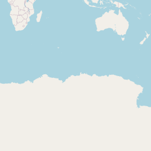

# The World of Interactive Web Maps

## Introduction

Maps are not merely tools for navigation; they represent a convergence of technology, art, and data visualization.
In today's digital age, web maps offer functionalities that extend from driving directions to intricate data visualization.
This guide demystifies the intricate world of web maps and the technologies that make them possible.

## Map Projections

Our planet is a sphere, but our screens are flat.
This discrepancy requires the use of special map projections to squeeze our round planet onto a flat map.
There are many hundreds of these projections.

 Some <a href="https://en.wikipedia.org/wiki/List_of_map_projections">examples of map projections</a>

Among these many different projections, the Web Mercator projection is the most widely used for web maps.

 The <a href="https://en.wikipedia.org/wiki/Mercator_projection">Mercator projection</a> exaggerates areas far from the equator.

Unfortunately, it enlarges regions near the poles, such as Greenland and Antarctica, and ends at 85° north and south, essentially cutting off the poles.
On the other hand [it does not distort details](https://en.wikipedia.org/wiki/Conformal_map_projection), and at all points north is always up, west is always to the left, and so on.

The Web Mercator projection is not without its flaws, but it's a good compromise.

## Map Tiles

The Web Mercator projection projects the Earth onto a square, stored as an image file, usually at a resolution of 256x256 pixels.

 0/0/0.png

This gives an overview of the earth, but as you zoom in, the image becomes blurred as the pixels get larger.
This is why you want to use a web map frontend such as Leaflet, MapLibre or OpenLayers.
They handle the user interaction with the web map and the loading of the data.
When you zoom into the map, the frontend knows that the image has become too pixelated and replaces it with four images, effectively doubling the resolution.

<table align="center" border="0">
<tr>
<td align="center"> 1/0/0.png</td>
<td align="center"> 1/1/0.png</td>
</tr>
<tr>
<td align="center"> 1/0/1.png</td>
<td align="center"> 1/1/1.png</td>
</tr>
</table>

As you zoom in, the map tiles are replaced with their four sub tiles at each successive zoom level.
The number of tiles grows exponentially, so the frontend only loads the tiles that are actually visible.

## Organizing the Tiles

The frontend handles the interaction and loading of the image tiles.
So the frontend needs to know where to load the tiles from.
To do this, the tiles are organised in folders using a specific URL pattern: `/\$z/\$x/\$y.png`, where `\$z` is the zoom level, and `\$x` and `\$y` are the column and row of the tile.

Each zoom level quadruples the number of tiles, reaching staggering numbers.
For example, zoom level 10 has over 1 million tiles (4^10), while zoom level 15 has over 1 billion (4^15).

Storing all these images as files can be a huge challenge, as many file systems can't even handle that many entries.
To manage these tiles, they are usually stored in a large single file container.

`.mbtiles` containers are widely used.
These are actually SQLite databases.
One of the tables inside the database stores all the tiles as table rows.

Accessing a tile is done via SQL queries.
To serve tiles under a URL like `/\$z/\$x/\$y.png`, you need a map server that translates incoming HTTP requests with this URL pattern into SQL queries and returns the requested tile.

Despite its disadvantages and added complexity, using a tile container like `.mbtiles` makes it much easier to manage millions of tiles.

## Vector Tiles

Using image tiles has some disadvantages.
For example, labels such as country or street names are permanently embedded.
When you zoom in, these labels become larger and then disappear, to be replaced by smaller versions of the labels at the next zoom level.
When you rotate the map, the labels also rotate and become difficult to read.
It would be better if the labels could somehow float independently, always staying horizontal, at the same position and size.

To achieve this and to overcome other problems with image tiles, vector tiles have been developed.
They contain the raw vector data of each object, stored as points, lines and polygons, describing labels, roads and lakes.
Each object stores additional properties such as "type" or "name".
A separate file (tile.json) [describes the structure and properties of the vector data](https://docs.mapbox.com/help/glossary/tilejson/).
A second file (style.json) [describes the visual appearance](https://maplibre.org/maplibre-style-spec/) of this vector data.
For example, what colour to use for water, forests or highways, how many pixels wide is a road or country boundary, etc.

## The Complexity and Advantages of Vector Tiles

This system of encoding geodata into vector tiles and drawing them using a style definition is undoubtedly more complex than simply displaying images.
However, this system allows much more flexibility and control over how maps are displayed, as you can style your map in any way you like in the frontend, including hiding unwanted layers such as labels.
And because all drawing operations are performed on the graphics card (e.g. using WebGL), the speed is amazing, even when visualising 100,000 data points on the map.

## Conclusion

Interactive web maps using vector tiles are a blend of several technologies, combining mathematics, art and code.
Although the technology is much more complex, with VersaTiles we have tried to provide you with everything you need to set up your own map service in just a few minutes.