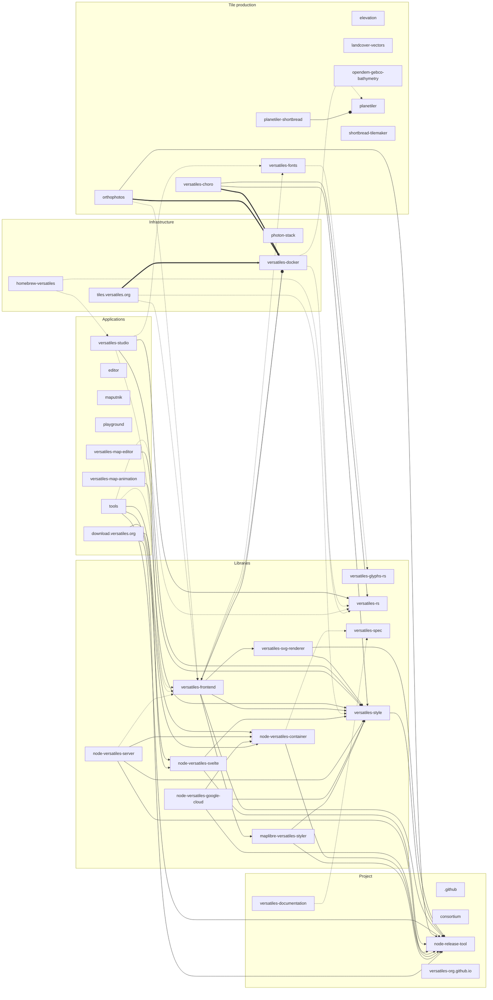

<!-- Generated by scripts/build-dependency-graph.ts — do not edit. -->

# Repository dependencies

> [!NOTE]
> This page is generated from the public repositories of the
> [versatiles-org](https://github.com/versatiles-org) organisation. To correct or extend it, change
> [`scripts/dependency-graph.yaml`](https://github.com/versatiles-org/versatiles-documentation/blob/main/scripts/dependency-graph.yaml)
> or the repository it describes — edits made here are overwritten.

VersaTiles is not one program but a few dozen repositories that build on each other:
a Rust core, npm packages, Docker images, tile-generation pipelines and the sites that
serve the result. Those links are easy to lose track of, because they are written down
in a different place every time — a `package.json` here, a `FROM` line there, a `curl`
in a shell script somewhere else.

This page collects all of them in one place.

## Overview

An arrow points **from a repository to what it depends on**, and the layout runs left to
right: whatever is built on most ends up on the right, with everything that builds on it
to the left. Line style says how the dependency is expressed; colour says what the
repository is.

A graph of the whole organisation is a lot at once, so it can be narrowed down — by one
kind of dependency at a time, or to the repositories that carry a given tag. Several
repositories carry more than one: versatiles-rs is both a library to build on and the
tool that converts tilesets, and it shows up under either.

<DependencyGraph />

::: details The same graph as a static diagram
Generated as Mermaid, and readable without JavaScript. It draws one arrow per pair of
repositories, using the most substantial of their links:

| Arrow  | Meaning                                                                                                                                                                                                                              |
| ------ | ------------------------------------------------------------------------------------------------------------------------------------------------------------------------------------------------------------------------------------ |
| `-->`  | **npm packages** / **Rust crates** — The repository lists a `@versatiles/…` package among its npm dependencies. The repository depends on one of the project’s crates in `Cargo.toml`.                                               |
| `==>`  | **Docker images** — A `Dockerfile` builds on an image produced by another repository.                                                                                                                                                |
| `-.->` | **Downloaded artifacts** / **Declared by hand** — Build scripts or runtime code fetch release assets or raw files from another repository. A dependency no parser can see — recorded in `scripts/dependency-graph.yaml` with a note. |
| `--o`  | **CI and release automation** — A GitHub Actions workflow uses an action, reusable workflow or dispatch of another repository.                                                                                                       |

:::

## Repositories

### Libraries

Code to build on — crates, npm packages and the container specification.

| Repository                                                                                     | Also            | Description                                                                                                               | Depends on | Used by |
| ---------------------------------------------------------------------------------------------- | --------------- | ------------------------------------------------------------------------------------------------------------------------- | ---------- | ------- |
| [maplibre-versatiles-styler](https://github.com/versatiles-org/maplibre-versatiles-styler)     | Applications    | MapLibre GL JS plugin for editing and managing VersaTiles map styles directly in the browser.                             | 2          | 1       |
| [node-versatiles-container](https://github.com/versatiles-org/node-versatiles-container)       | —               | Node.js library for reading VersaTiles container files.                                                                   | 2          | 4       |
| [node-versatiles-google-cloud](https://github.com/versatiles-org/node-versatiles-google-cloud) | Infrastructure  | Google Cloud integration tools for hosting and serving VersaTiles data.                                                   | 3          | 0       |
| [node-versatiles-server](https://github.com/versatiles-org/node-versatiles-server)             | Applications    | Node.js implementation of a VersaTiles tile server.                                                                       | 4          | 0       |
| [node-versatiles-svelte](https://github.com/versatiles-org/node-versatiles-svelte)             | —               | Svelte components and bindings for displaying VersaTiles data in MapLibre GL JS.                                          | 2          | 2       |
| [versatiles-frontend](https://github.com/versatiles-org/versatiles-frontend)                   | Applications    | Frontend web applications for exploring VersaTiles maps and datasets.                                                     | 6          | 6       |
| [versatiles-glyphs-rs](https://github.com/versatiles-org/versatiles-glyphs-rs)                 | Tile production | Rust implementation of a signed-distance-field (SDF) glyph renderer used in map rendering.                                | 0          | 1       |
| [versatiles-rs](https://github.com/versatiles-org/versatiles-rs)                               | Tile production | Core Rust implementation of the VersaTiles toolkit for converting, validating, and serving map tiles in multiple formats. | 0          | 5       |
| [versatiles-spec](https://github.com/versatiles-org/versatiles-spec)                           | —               | Specification for VersaTiles containers.                                                                                  | 0          | 2       |
| [versatiles-style](https://github.com/versatiles-org/versatiles-style)                         | —               | Toolkit for generating MapLibre styles.                                                                                   | 1          | 11      |
| [versatiles-svg-renderer](https://github.com/versatiles-org/versatiles-svg-renderer)           | —               | renders maps as SVG                                                                                                       | 2          | 1       |

### Applications

Programs and sites people open and use directly.

| Repository                                                                             | Also           | Description                                                                                   | Depends on | Used by |
| -------------------------------------------------------------------------------------- | -------------- | --------------------------------------------------------------------------------------------- | ---------- | ------- |
| [download.versatiles.org](https://github.com/versatiles-org/download.versatiles.org)   | Infrastructure | Data download hub for VersaTiles datasets.                                                    | 3          | 0       |
| [editor](https://github.com/versatiles-org/editor)                                     | —              | Modified Maputnik for Versatiles Styles                                                       | 0          | 0       |
| [maputnik](https://github.com/versatiles-org/maputnik)                                 | —              | An open source visual editor for the 'MapLibre Style Specification'                           | 0          | 0       |
| [playground](https://github.com/versatiles-org/playground)                             | Project        | Interactive playground demonstrating how to use VersaTiles in web applications.               | 0          | 0       |
| [tools](https://github.com/versatiles-org/tools)                                       | —              | Utility scripts and helper tools built around the VersaTiles ecosystem.                       | 5          | 0       |
| [versatiles-map-animation](https://github.com/versatiles-org/versatiles-map-animation) | —              | Browser-based editor for composing keyframe camera animations on a VersaTiles map.            | 1          | 0       |
| [versatiles-map-editor](https://github.com/versatiles-org/versatiles-map-editor)       | —              | —                                                                                             | 1          | 0       |
| [versatiles-studio](https://github.com/versatiles-org/versatiles-studio)               | —              | Cross-platform desktop application for opening, inspecting, styling and converting map tiles. | 4          | 1       |

### Tile production

Pipelines and images that turn open data into tilesets, fonts and sprites.

| Repository                                                                             | Also         | Description                                                                      | Depends on | Used by |
| -------------------------------------------------------------------------------------- | ------------ | -------------------------------------------------------------------------------- | ---------- | ------- |
| [elevation](https://github.com/versatiles-org/elevation)                               | —            | —                                                                                | 0          | 0       |
| [landcover-vectors](https://github.com/versatiles-org/landcover-vectors)               | —            | Generate landcover vector tiles from ESA Worldcover                              | 0          | 0       |
| [opendem-gebco-bathymetry](https://github.com/versatiles-org/opendem-gebco-bathymetry) | —            | Versatiles Container from GEBCO Bathymetry Data provided by OpenDEM              | 0          | 0       |
| [orthophotos](https://github.com/versatiles-org/orthophotos)                           | —            | Processing pipeline and hosting setup for global and regional orthophoto layers. | 3          | 0       |
| [planetiler](https://github.com/versatiles-org/planetiler)                             | —            | Flexible tool to build planet-scale vector tilesets from OpenStreetMap data fast | 0          | 2       |
| [planetiler-shortbread](https://github.com/versatiles-org/planetiler-shortbread)       | —            | Native Java Planetiler profile generating vector tiles in the Shortbread schema  | 1          | 0       |
| [shortbread-tilemaker](https://github.com/versatiles-org/shortbread-tilemaker)         | —            | Tilemaker configuration for generating Shortbread vector tiles.                  | 0          | 0       |
| [versatiles-choro](https://github.com/versatiles-org/versatiles-choro)                 | Applications | Modular Docker-based pipeline for creating interactive choropleth maps           | 3          | 0       |
| [versatiles-fonts](https://github.com/versatiles-org/versatiles-fonts)                 | —            | Repository of open-source SDF fonts optimized for MapLibre GL JS rendering.      | 1          | 2       |

### Infrastructure

How the software is packaged, deployed and hosted.

| Repository                                                                     | Also            | Description                                                   | Depends on | Used by |
| ------------------------------------------------------------------------------ | --------------- | ------------------------------------------------------------- | ---------- | ------- |
| [homebrew-versatiles](https://github.com/versatiles-org/homebrew-versatiles)   | —               | Homebrew tap for installing VersaTiles CLI tools on macOS.    | 2          | 0       |
| [photon-stack](https://github.com/versatiles-org/photon-stack)                 | —               | —                                                             | 0          | 0       |
| [tiles.versatiles.org](https://github.com/versatiles-org/tiles.versatiles.org) | Applications    | Tile hosting service for public VersaTiles datasets.          | 3          | 0       |
| [versatiles-docker](https://github.com/versatiles-org/versatiles-docker)       | Tile production | Docker images and build scripts for the VersaTiles ecosystem. | 3          | 4       |

### Project

Documentation, release tooling and the rest of what keeps the project running.

| Repository                                                                             | Also | Description                                                                                   | Depends on | Used by |
| -------------------------------------------------------------------------------------- | ---- | --------------------------------------------------------------------------------------------- | ---------- | ------- |
| [.github](https://github.com/versatiles-org/.github)                                   | —    | Shared GitHub workflows, templates, and issue configurations for all VersaTiles repositories. | 0          | 0       |
| [consortium](https://github.com/versatiles-org/consortium)                             | —    | —                                                                                             | 0          | 0       |
| [node-release-tool](https://github.com/versatiles-org/node-release-tool)               | —    | Helper tool for automating Node.js package releases across VersaTiles repositories.           | 0          | 11      |
| [versatiles-documentation](https://github.com/versatiles-org/versatiles-documentation) | —    | Documentation for the VersaTiles ecosystem.                                                   | 1          | 0       |
| [versatiles-org.github.io](https://github.com/versatiles-org/versatiles-org.github.io) | —    | Source code for the public website at versatiles.org.                                         | 0          | 0       |

## How each link is declared

A dependency can be written down in half a dozen different ways, each one found in a
different kind of file. Every arrow in the graph above comes from one of the lines
listed below, and can be followed back to it.

### npm packages

The repository lists a `@versatiles/…` package among its npm dependencies.

::: details Where these 30 links come from

| From                         | To                         | Found                               | Source                                                                                                    |
| ---------------------------- | -------------------------- | ----------------------------------- | --------------------------------------------------------------------------------------------------------- |
| download.versatiles.org      | node-release-tool          | `@versatiles/release-tool@^2.9.1`   | [package.json](https://github.com/versatiles-org/download.versatiles.org/blob/main/package.json#L59)      |
| download.versatiles.org      | node-versatiles-container  | `@versatiles/container@^2.0.0`      | [package.json](https://github.com/versatiles-org/download.versatiles.org/blob/main/package.json#L45)      |
| download.versatiles.org      | node-versatiles-svelte     | `@versatiles/svelte@^2.3.1`         | [package.json](https://github.com/versatiles-org/download.versatiles.org/blob/main/package.json#L46)      |
| maplibre-versatiles-styler   | node-release-tool          | `@versatiles/release-tool@^2.9.1`   | [package.json](https://github.com/versatiles-org/maplibre-versatiles-styler/blob/main/package.json#L44)   |
| maplibre-versatiles-styler   | versatiles-style           | `@versatiles/style@^5.13.1`         | [package.json](https://github.com/versatiles-org/maplibre-versatiles-styler/blob/main/package.json#L45)   |
| node-versatiles-container    | node-release-tool          | `@versatiles/release-tool@^2.9.1`   | [package.json](https://github.com/versatiles-org/node-versatiles-container/blob/main/package.json#L68)    |
| node-versatiles-google-cloud | node-release-tool          | `@versatiles/release-tool@^2.9.1`   | [package.json](https://github.com/versatiles-org/node-versatiles-google-cloud/blob/main/package.json#L77) |
| node-versatiles-google-cloud | node-versatiles-container  | `@versatiles/container@^1.5.1`      | [package.json](https://github.com/versatiles-org/node-versatiles-google-cloud/blob/main/package.json#L63) |
| node-versatiles-google-cloud | versatiles-style           | `@versatiles/style@^5.13.1`         | [package.json](https://github.com/versatiles-org/node-versatiles-google-cloud/blob/main/package.json#L64) |
| node-versatiles-server       | node-release-tool          | `@versatiles/release-tool@^2.9.1`   | [package.json](https://github.com/versatiles-org/node-versatiles-server/blob/main/package.json#L73)       |
| node-versatiles-server       | node-versatiles-container  | `@versatiles/container@^1.5.1`      | [package.json](https://github.com/versatiles-org/node-versatiles-server/blob/main/package.json#L63)       |
| node-versatiles-server       | versatiles-style           | `@versatiles/style@^5.13.1`         | [package.json](https://github.com/versatiles-org/node-versatiles-server/blob/main/package.json#L64)       |
| node-versatiles-svelte       | node-release-tool          | `@versatiles/release-tool@^2.9.0`   | [package.json](https://github.com/versatiles-org/node-versatiles-svelte/blob/main/package.json#L58)       |
| node-versatiles-svelte       | versatiles-style           | `@versatiles/style@^5.13.0`         | [package.json](https://github.com/versatiles-org/node-versatiles-svelte/blob/main/package.json#L85)       |
| orthophotos                  | node-release-tool          | `@versatiles/release-tool@^2.9.1`   | [package.json](https://github.com/versatiles-org/orthophotos/blob/main/package.json#L36)                  |
| tools                        | node-release-tool          | `@versatiles/release-tool@^2.10.0`  | [package.json](https://github.com/versatiles-org/tools/blob/main/package.json#L42)                        |
| tools                        | node-versatiles-container  | `@versatiles/container@^2.0.0`      | [package.json](https://github.com/versatiles-org/tools/blob/main/package.json#L41)                        |
| tools                        | node-versatiles-svelte     | `@versatiles/svelte@^2.3.1`         | [package.json](https://github.com/versatiles-org/tools/blob/main/package.json#L43)                        |
| versatiles-choro             | versatiles-rs              | `@versatiles/versatiles-rs@^4.10.0` | [package.json](https://github.com/versatiles-org/versatiles-choro/blob/main/package.json#L47)             |
| versatiles-choro             | versatiles-style           | `@versatiles/style@^5.13.1`         | [package.json](https://github.com/versatiles-org/versatiles-choro/blob/main/package.json#L68)             |
| versatiles-frontend          | maplibre-versatiles-styler | `maplibre-versatiles-styler@^1.3.2` | [package.json](https://github.com/versatiles-org/versatiles-frontend/blob/main/package.json#L59)          |
| versatiles-frontend          | node-release-tool          | `@versatiles/release-tool@^2.9.0`   | [package.json](https://github.com/versatiles-org/versatiles-frontend/blob/main/package.json#L46)          |
| versatiles-frontend          | versatiles-style           | `@versatiles/style@^5.13.1`         | [package.json](https://github.com/versatiles-org/versatiles-frontend/blob/main/package.json#L47)          |
| versatiles-frontend          | versatiles-svg-renderer    | `@versatiles/svg-renderer@^1.1.0`   | [package.json](https://github.com/versatiles-org/versatiles-frontend/blob/main/package.json#L48)          |
| versatiles-map-animation     | versatiles-style           | `@versatiles/style@^5.13.1`         | [package.json](https://github.com/versatiles-org/versatiles-map-animation/blob/main/package.json#L35)     |
| versatiles-map-editor        | versatiles-style           | `@versatiles/style@^5.13.1`         | [package.json](https://github.com/versatiles-org/versatiles-map-editor/blob/main/package.json#L25)        |
| versatiles-studio            | versatiles-style           | `@versatiles/style@^5.13.1`         | [package.json](https://github.com/versatiles-org/versatiles-studio/blob/main/package.json#L82)            |
| versatiles-style             | node-release-tool          | `@versatiles/release-tool@^2.9.0`   | [package.json](https://github.com/versatiles-org/versatiles-style/blob/main/package.json#L65)             |
| versatiles-svg-renderer      | node-release-tool          | `@versatiles/release-tool@^2.9.0`   | [package.json](https://github.com/versatiles-org/versatiles-svg-renderer/blob/main/package.json#L92)      |
| versatiles-svg-renderer      | versatiles-style           | `@versatiles/style@^5.13.1`         | [package.json](https://github.com/versatiles-org/versatiles-svg-renderer/blob/main/package.json#L93)      |

:::

### Rust crates

The repository depends on one of the project’s crates in `Cargo.toml`.

::: details Where these 5 links come from

| From              | To            | Found                  | Source                                                                                     |
| ----------------- | ------------- | ---------------------- | ------------------------------------------------------------------------------------------ |
| versatiles-studio | versatiles-rs | `versatiles`           | [Cargo.toml](https://github.com/versatiles-org/versatiles-studio/blob/main/Cargo.toml#L23) |
| versatiles-studio | versatiles-rs | `versatiles_container` | [Cargo.toml](https://github.com/versatiles-org/versatiles-studio/blob/main/Cargo.toml#L18) |
| versatiles-studio | versatiles-rs | `versatiles_core`      | [Cargo.toml](https://github.com/versatiles-org/versatiles-studio/blob/main/Cargo.toml#L17) |
| versatiles-studio | versatiles-rs | `versatiles_geometry`  | [Cargo.toml](https://github.com/versatiles-org/versatiles-studio/blob/main/Cargo.toml#L20) |
| versatiles-studio | versatiles-rs | `versatiles_pipeline`  | [Cargo.toml](https://github.com/versatiles-org/versatiles-studio/blob/main/Cargo.toml#L19) |

:::

### Docker images

A `Dockerfile` builds on an image produced by another repository.

::: details Where these 4 links come from

| From                 | To                | Found                                    | Source                                                                                                         |
| -------------------- | ----------------- | ---------------------------------------- | -------------------------------------------------------------------------------------------------------------- |
| orthophotos          | versatiles-docker | `ghcr.io/versatiles-org/versatiles-gdal` | [Dockerfile](https://github.com/versatiles-org/orthophotos/blob/main/Dockerfile#L2)                            |
| tiles.versatiles.org | versatiles-docker | `versatiles/versatiles`                  | [compose.yaml](https://github.com/versatiles-org/tiles.versatiles.org/blob/main/compose.yaml#L4)               |
| tiles.versatiles.org | versatiles-docker | `versatiles/versatiles`                  | [download/Dockerfile](https://github.com/versatiles-org/tiles.versatiles.org/blob/main/download/Dockerfile#L5) |
| versatiles-choro     | versatiles-docker | `versatiles/versatiles-tippecanoe`       | [docker/Dockerfile](https://github.com/versatiles-org/versatiles-choro/blob/main/docker/Dockerfile#L1)         |

:::

### Downloaded artifacts

Build scripts or runtime code fetch release assets or raw files from another repository.

::: details Where these 26 links come from

| From                      | To                   | Found                                                    | Source                                                                                                                                                     |
| ------------------------- | -------------------- | -------------------------------------------------------- | ---------------------------------------------------------------------------------------------------------------------------------------------------------- |
| homebrew-versatiles       | versatiles-rs        | `github.com/versatiles-org/versatiles-rs/releases`       | [bin/make_formula.sh](https://github.com/versatiles-org/homebrew-versatiles/blob/main/bin/make_formula.sh#L6)                                              |
| homebrew-versatiles       | versatiles-studio    | `"versatiles-org/versatiles-studio"`                     | [bin/make_cask.sh](https://github.com/versatiles-org/homebrew-versatiles/blob/main/bin/make_cask.sh#L21)                                                   |
| node-versatiles-container | versatiles-spec      | `github.com/versatiles-org/versatiles-spec/blob`         | [src/index.ts](https://github.com/versatiles-org/node-versatiles-container/blob/main/src/index.ts#L162)                                                    |
| node-versatiles-container | versatiles-spec      | `github.com/versatiles-org/versatiles-spec/blob`         | [src/lib/interfaces.ts](https://github.com/versatiles-org/node-versatiles-container/blob/main/src/lib/interfaces.ts#L72)                                   |
| node-versatiles-server    | versatiles-frontend  | `github.com/versatiles-org/versatiles-frontend/releases` | [scripts/update-frontend.sh](https://github.com/versatiles-org/node-versatiles-server/blob/main/scripts/update-frontend.sh#L16)                            |
| orthophotos               | versatiles-frontend  | `github.com/versatiles-org/versatiles-frontend/releases` | [src/server/frontend.ts](https://github.com/versatiles-org/orthophotos/blob/main/src/server/frontend.ts#L25)                                               |
| tiles.versatiles.org      | versatiles-frontend  | `github.com/versatiles-org/versatiles-frontend/releases` | [bin/frontend/update.sh](https://github.com/versatiles-org/tiles.versatiles.org/blob/main/bin/frontend/update.sh#L21)                                      |
| tiles.versatiles.org      | versatiles-style     | `github.com/versatiles-org/versatiles-style/releases`    | [bin/styles/update.sh](https://github.com/versatiles-org/tiles.versatiles.org/blob/main/bin/styles/update.sh#L21)                                          |
| tools                     | versatiles-frontend  | `github.com/versatiles-org/versatiles-frontend/releases` | [src/routes/setup_server/generate_code.ts](https://github.com/versatiles-org/tools/blob/main/src/routes/setup_server/generate_code.ts#L168)                |
| tools                     | versatiles-rs        | `github.com/versatiles-org/versatiles-rs/releases`       | [src/routes/setup_server/generate_code.ts](https://github.com/versatiles-org/tools/blob/main/src/routes/setup_server/generate_code.ts#L102)                |
| versatiles-choro          | versatiles-rs        | `github.com/versatiles-org/versatiles-rs.git`            | [docker/Dockerfile](https://github.com/versatiles-org/versatiles-choro/blob/main/docker/Dockerfile#L16)                                                    |
| versatiles-docker         | planetiler           | `github.com/versatiles-org/planetiler.git`               | [versatiles-planetiler/Dockerfile](https://github.com/versatiles-org/versatiles-docker/blob/main/versatiles-planetiler/Dockerfile#L24)                     |
| versatiles-docker         | versatiles-frontend  | `"versatiles-org/versatiles-frontend"`                   | [versatiles-frontend/build.sh](https://github.com/versatiles-org/versatiles-docker/blob/main/versatiles-frontend/build.sh#L23)                             |
| versatiles-docker         | versatiles-frontend  | `github.com/versatiles-org/versatiles-frontend/releases` | [versatiles-frontend/Dockerfile](https://github.com/versatiles-org/versatiles-docker/blob/main/versatiles-frontend/Dockerfile#L12)                         |
| versatiles-docker         | versatiles-frontend  | `github.com/versatiles-org/versatiles-frontend/releases` | [versatiles-nginx/scripts/fetch_frontend.sh](https://github.com/versatiles-org/versatiles-docker/blob/main/versatiles-nginx/scripts/fetch_frontend.sh#L66) |
| versatiles-docker         | versatiles-rs        | `"versatiles-org/versatiles-rs"`                         | [scripts/utils.sh](https://github.com/versatiles-org/versatiles-docker/blob/main/scripts/utils.sh#L72)                                                     |
| versatiles-docker         | versatiles-rs        | `github.com/versatiles-org/versatiles-rs.git`            | [versatiles-gdal/Dockerfile](https://github.com/versatiles-org/versatiles-docker/blob/main/versatiles-gdal/Dockerfile#L13)                                 |
| versatiles-docker         | versatiles-rs        | `github.com/versatiles-org/versatiles-rs/releases`       | [scripts/download_versatiles_binary.sh](https://github.com/versatiles-org/versatiles-docker/blob/main/scripts/download_versatiles_binary.sh#L41)           |
| versatiles-documentation  | versatiles-spec      | `'versatiles-org/versatiles-spec'`                       | [scripts/sync-spec.ts](https://github.com/versatiles-org/versatiles-documentation/blob/main/scripts/sync-spec.ts#L25)                                      |
| versatiles-fonts          | versatiles-glyphs-rs | `github.com/versatiles-org/versatiles-glyphs-rs/raw`     | [.github/workflows/release.yml](https://github.com/versatiles-org/versatiles-fonts/blob/main/.github/workflows/release.yml#L31)                            |
| versatiles-fonts          | versatiles-glyphs-rs | `github.com/versatiles-org/versatiles-glyphs-rs/raw`     | [scripts/build.ts](https://github.com/versatiles-org/versatiles-fonts/blob/main/scripts/build.ts#L12)                                                      |
| versatiles-frontend       | versatiles-fonts     | `github.com/versatiles-org/versatiles-fonts/releases`    | [frontends/config.ts](https://github.com/versatiles-org/versatiles-frontend/blob/main/frontends/config.ts#L10)                                             |
| versatiles-frontend       | versatiles-style     | `github.com/versatiles-org/versatiles-style/releases`    | [frontends/config.ts](https://github.com/versatiles-org/versatiles-frontend/blob/main/frontends/config.ts#L33)                                             |
| versatiles-studio         | versatiles-fonts     | `'versatiles-org/versatiles-fonts'`                      | [scripts/update-assets.ts](https://github.com/versatiles-org/versatiles-studio/blob/main/scripts/update-assets.ts#L33)                                     |
| versatiles-studio         | versatiles-frontend  | `'versatiles-org/versatiles-frontend'`                   | [scripts/update-assets.ts](https://github.com/versatiles-org/versatiles-studio/blob/main/scripts/update-assets.ts#L34)                                     |
| versatiles-studio         | versatiles-style     | `'versatiles-org/versatiles-style'`                      | [scripts/update-assets.ts](https://github.com/versatiles-org/versatiles-studio/blob/main/scripts/update-assets.ts#L32)                                     |

:::

### CI and release automation

A GitHub Actions workflow uses an action, reusable workflow or dispatch of another repository.

::: details Where these 2 links come from

| From                  | To                | Found                                                                                            | Source                                                                                                                             |
| --------------------- | ----------------- | ------------------------------------------------------------------------------------------------ | ---------------------------------------------------------------------------------------------------------------------------------- |
| planetiler-shortbread | planetiler        | `versatiles-org/planetiler`                                                                      | [.github/workflows/ci.yml](https://github.com/versatiles-org/planetiler-shortbread/blob/main/.github/workflows/ci.yml#L76)         |
| versatiles-frontend   | versatiles-docker | `api.github.com/repos/versatiles-org/versatiles-docker/actions/workflows/release.yml/dispatches` | [.github/workflows/release.yml](https://github.com/versatiles-org/versatiles-frontend/blob/main/.github/workflows/release.yml#L68) |

:::

## How this page is made

`scripts/build-dependency-graph.ts` reads the public repositories of the organisation
and looks for dependencies in the places they are actually declared: `package.json`,
`Cargo.toml`, `Dockerfile`s, GitHub Actions workflows, and build or install scripts that
fetch release assets. Markdown is deliberately not searched — README badges and prose
links mention half the organisation and say nothing about what a build needs.

Every arrow therefore has a file and a line behind it, listed in the tables above and
available as machine-readable data at
[`/dependency-graph.json`](/dependency-graph.json). What no parser can see —
operational dependencies, for instance — is declared by hand in
[`scripts/dependency-graph.yaml`](https://github.com/versatiles-org/versatiles-documentation/blob/main/scripts/dependency-graph.yaml),
which is also where false positives are filtered out and repositories are assigned to
the tags above.

The following repositories are left out:

- [planetiler-shortbread-docker](https://github.com/versatiles-org/planetiler-shortbread-docker) — archived
- [shortbread-compare-demo](https://github.com/versatiles-org/shortbread-compare-demo) — archived
- [versatiles-generator](https://github.com/versatiles-org/versatiles-generator) — archived

Private repositories are not included, and neither are dependencies on software outside
the organisation.
