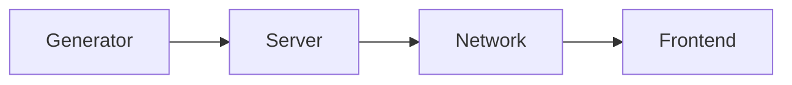

# VersaTiles Reference Model

Our reference pipeline consists of four segments:



1. **Generator:** Creates map tiles from a data source, such as vector tiles from OpenStreetMap data or image tiles from satellite or aerial imagery.
2. **Server:** Manages the storage and distribution of map tiles.
3. **Network:** Handles all network-related issues, including TLS certificates, load balancing, CORS and caching.
4. **Frontend:** Provides the user interface for interactive maps.

> [!WARNING] VersaTiles is still under development.
Please note that not all pipeline specifications are final and we may encounter unforeseen use cases, problems or features that require minor adjustments. However, the majority of the pipeline is stable.


## Layer: Generator

The generator layer creates map tiles, which can be either image or vector tiles.

We have chosen not to use the [OpenMapTiles schema](https://openmaptiles.org/schema/) for vector tiles because we feel it does not embody the openness we are aiming for. In particular, the requirement to include links to the MapTiler website or to pay licensing fees seems more like a marketing strategy than a commitment to open standards. Instead, we have chosen to use the free [Shortbread schema](https://shortbread-tiles.org) originally developed by GeoFabrik. We acknowledge that this choice has implications, such as the incompatibility of map styles designed for OpenMapTiles vs. Shortbread. 

But if we're going to start from scratch, let's get it right from the beginning.

While users are free to deviate from our recommendations and use the OpenMapTiles schema, we will continue to focus our efforts on the Shortbread schema.

Users can skip the tile generation process altogether and download our pre-built map tiles for the entire planet directly from [download.versatiles.org](https://download.versatiles.org).


### Requirements/Recommendations

- Tiles SHOULD be packed in a [*.versatiles container](https://github.com/versatiles-org/versatiles-spec/).
- Vector tiles SHOULD follow the [Shortbread Schema](https://shortbread-tiles.org/).
- Containers SHOULD include detailed metadata conforming to [TileJSON 3.0.0](https://github.com/mapbox/tilejson-spec/tree/master/3.0.0), specifically:
  - `attribution` detailing the copyright of the source data.
  - `vector_layers` describing the vector tile layers and their properties.
- You SHOULD use optimal compression techniques to efficiently reduce tile size without compromising data integrity. Recommended methods include:
  - Use Brotli compression for vector tiles.
  - Use WebP format for raster tiles.
- The filename of the container SHOULD follow the format `<content>[.<schema>][.<coverage>][.<date>].versatiles`, where:
  - `<content>` describes the content, e.g: `osm`, `hillshade` or `satellite`.
  - `<schema>` (optional) e.g.: `shortbread` or `openmaptiles`.
  - `<coverage>` (optional) specifies the geographical coverage, if not planet wide, e.g: `europe` or `kyiv`.
  - `<date>` (optional) is a [basic ISO date](https://en.wikipedia.org/wiki/ISO_8601#Calendar_dates) (YYYYMMDD), e.g: `20151021`.


### Status

- [x] Implement the generator using Tilemaker ([repo](https://github.com/versatiles-org/shortbread-tilemaker))
- [x] Use the Shortbread schema ([repo](https://github.com/versatiles-org/shortbread-tilemaker))
- [ ] Add more languages besides local, english and german ([issue](https://github.com/shortbread-tiles/shortbread-docs/issues/22))
- [x] generate `.versatiles` instead of `.mbtiles` ([repo](https://github.com/versatiles-org/versatiles-converter))
- [x] merge the converter into the generator and use docker ([issue](https://github.com/versatiles-org/versatiles-generator/issues/1))
- [x] use Tilemaker 3.0.0 to reduce memory usage ([issue](https://github.com/versatiles-org/shortbread-tilemaker/issues/7))
- [x] migrate to a cheaper cloud provider (like Hetzner)
- [ ] Reduce the size of vector tiles ([issue](https://github.com/versatiles-org/versatiles-generator/issues/7))
- [ ] improve lower zoom levels ([issue](https://github.com/versatiles-org/versatiles-generator/issues/2)), especially merge and simplify polygons where possible
- [x] generate hill shading ([issue](https://registry.opendata.aws/terrain-tiles/))
- [ ] Generate satellite imagery (using Landsat/SENTINEL, aerial imagery from national open data platforms and open MAXAR imagery)


## Interface: Container

A frequently asked question is why we decided to develop our own container format. The reasons are many:

A critical need within the OSM community is for map tile servers to automatically and quickly reflect updates to OSM data. While this real-time updating is critical for some OSM contributors, it is not as important for a wider audience. News organisations, data journalists, NGOs and many front-end developers often only need a basic map background that may be a few months old. The need to monitor real-time changes is not a priority for these users. However, the insistence on up-to-the-minute updates adds significant complexity and resource requirements, requiring all OSM objects to be stored and indexed in a PostgreSQL/PostGIS database, and all changed tiles to be updated immediately. This requirement makes it difficult to develop simple, low-cost solutions. Instead, we will focus on pre-generated tiles stored in a file container.

The most commonly used container format is [MBTiles](https://wiki.openstreetmap.org/wiki/MBTiles), which is essentially a SQLite database containing a row for each tile, with the tile data stored as gzipped blobs. Despite its flexibility, MBTiles has several drawbacks:
1. It requires local or mounted server storage and cannot be hosted on remote cloud storage.
2. SQLite becomes a necessary dependency. (like libsqlite3-dev)
3. Processing many tiles is inefficient given SQLite's limited throughput.

In response, some have turned to cloud-optimised map tile container formats such as [COMTiles](https://github.com/mactrem/com-tiles) or [PMTiles](https://github.com/protomaps/PMTiles), which consolidate tiles into a single file with an appended index for byte-range lookups of each tile. These formats are tailored to specific use cases; for example, PMTiles is designed for storage on public cloud storage such as AWS S3 and can be accessed serverlessly via JavaScript using HTTP range requests. While the concept of serverless tile hosting is innovative, it has notable drawbacks such as slow initialisation, uncompressed tile data and caching challenges. Our goal is to remain independent of container formats that are application specific or prone to divergent future development paths.

Accordingly, we have taken the lessons learned from COMTiles and PMTiles to create a uniquely simple container format, which is described here: [VersaTiles Container Specification](https://github.com/versatiles-org/versatiles-spec/blob/main/v02/readme.md).

A unique feature of our format is the ability to perform fast spatial queries remotely. Users who only need a specific region, such as a continent, country or city, do not need to download the entire planet. Instead, they can use our [VersaTiles tool](https://github.com/versatiles-org/versatiles-rs) to filter and convert the remote container at [download.versatiles.org](https://download.versatiles.org) and download only an extract, for example:
```bash
versatiles convert --bbox "5,45,10,48" https://download.versatiles.org/osm.versatiles switzerland.versatiles
```
HTTP requests for successive tiles are combined to download thousands of tiles at once, resulting in very high performance. This allows parts of the planet to be extracted with no overhead. See the documentation on [partial download](https://github.com/versatiles-org/versatiles-documentation/blob/main/guides/download_tiles.md#partial-download) for more information.


### Requirements/Recommendations

- A container MUST conform to the VersaTiles Container Specification: [VersaTiles Spec](https://github.com/versatiles-org/versatiles-spec/blob/main/v02/readme.md).
- Tile data SHOULD use optimal compression.


### Status

- [x] Include metadata
- [x] Support all tile formats (image and vector)
- [x] Support all compression methods (gzip, brotli)
- [x] Enable bbox downloads
- [x] Finish the [specification] (https://github.com/versatiles-org/versatiles-spec/blob/main/v02/readme.md)


## Layer: Server

The server provides map tiles and static files via HTTP. These static files can include styles, sprites, fonts, JavaScript libraries and more.


### Requirements/Recommendations

- It MUST recognise and process [VersaTiles containers](https://github.com/versatiles-org/versatiles-spec/blob/v02/v02/container/readme.md).
- It SHOULD handle HTTP headers in particular:
  - `Content-Type` must accurately represent the MIME type.
  - `Accept-Encoding` and `Content-Encoding` for data compression; recompress data if necessary.
  - `Cache-Control` should be used to manage caching strategies for proxies, CDNs and browsers. Should include `no-transform`.
  - `Vary` should be set to `Accept-Encoding`.
  - Implement CORS headers such as `Access-Control-Allow-Origin` if required.
- The server should know its public URL for referencing resources.
- Organised tile and metadata access through a structured folder hierarchy is recommended:
  - `/tiles/`: The primary directory for retrieving tiles.
    - `/tiles/index.json`: An index of available tile sources.
    - `/tiles/{name}/{z}/{x}/{y}`: Standardised endpoints for accessing tiles.
    - `/tiles/{name}/tiles.json`: A valid [TileJSON 3.0.0](https://github.com/mapbox/tilejson-spec/tree/master/3.0.0).
  - `/assets/`: Houses additional resources such as styles, fonts, sprites and MapLibre GL JS files.
  - See [VersaTiles Frontend Specifications](specification_frontend.md) for more information.
- SHOULD be configured via `config.yaml` for a customised server setup, including domain setup, IP/port listening preferences, operation modes (development vs. production), tile source specification and static content management:

```yaml
server:
  host: '127.0.0.1'               # Listen on all network interfaces. Default: 0.0.0.0
  port: 3000                      # Port number for the server. Default: 8080
  domain: 'https://example.org'   # Publicly accessible URL of the server

# Performance settings: Use minimal recompression for development
fast: true                        # Set to false in production for full compression. Default: false

# Configuration for tile sources
tile_sources:
  - name: 'osm'
    source: './osm.versatiles'    # Local source for OpenStreetMap tiles
  - name: 'landsat'
    source: 'https://example.org/landsat.versatiles'   # Remote source for Landsat tiles

# Optional configuration for serving static content
static_content:
  - source: './styles'
    prefix: 'assets/styles'  # URL path prefix for styles; default prefix is "/"
  - source: './frontend.tar'

cors:
  # Default policy to allow or block CORS requests if they don't match any specific rules
  default_policy: 'block'  # Options: 'allow', 'block'

  # List of URL patterns to explicitly allow for CORS requests
  allow_patterns:
    - '^https?://trusteddomain\.com'
    - '^https?://*.example\.com'

  # List of URL patterns to explicitly block for CORS requests
  block_patterns:
    - '^https?://untrusteddomain\.com'
    - '^https?://*.malicious\.com'

logging:
  level: 'info'                   # Options: 'debug', 'info', 'warning', 'error'
  path: '/var/log/myserver.log'   # File path for log output
```


### Rust Implementation

We provide a high performance [Rust implementation](https://github.com/versatiles-org/versatiles-rs), available as both a CLI application and a Rust library ([crate](https://crates.io/crates/versatiles)).

Supported platforms include x86 and ARM (64 Bit) across:
- [x] Linux
- [x] MacOS
- [x] Windows

In addition to the source code, which can be [compiled using cargo](https://github.com/versatiles-org/versatiles-documentation/blob/main/guides/install_versatiles.md#building-from-source), we provide:
- [x] [Binary releases](https://github.com/versatiles-org/versatiles-rs/releases) via GitHub
- [x] Installation scripts for [Linux/MacOS](https://github.com/versatiles-org/versatiles-rs/blob/main/helpers/install-unix.sh) and [Windows](https://github.com/versatiles-org/versatiles-rs/blob/main/helpers/install-windows.ps1)
- [x] [Homebrew](https://github.com/versatiles-org/homebrew-versatiles)
- [ ] NixOS
- [ ] Snap ?
- [ ] Flatpak ?

Our [Docker images](https://hub.docker.com/u/versatiles) ([Repository](https://github.com/versatiles-org/versatiles-docker)) use Debian, Alpine and Scratch environments. They include variations with and without [all static frontend files](https://hub.docker.com/r/versatiles/versatiles-frontend/tags).

Future improvements will focus on:
- [ ] Proper CORS handling
- [ ] Full `config.yaml` support
- [x] Generation of tile size statistics
- [ ] Vector tile content debugging
- [ ] Implementing "diff" and "patch" commands for tile updates
- [ ] Implement a tile processing pipeline (alpha version already released. Run `versatiles help pipeline`)
- [ ] Develop an "overlay" command to overlay image tiles
- [ ] Improve the "overlay" command by implementing a [multi-scale approach](https://en.wikipedia.org/wiki/Multi-scale_approaches) to seamlessly overlay image tiles (see also [gradient-domain image processing](https://en.wikipedia.org/wiki/Gradient-domain_image_processing))


### NodeJS Implementations

Our NodeJS implementation includes
- [x] An [NPM library](https://github.com/versatiles-org/node-versatiles-container)
- [x] A basic [server](https://github.com/versatiles-org/node-versatiles-server)
- [ ] Full `config.yaml` support
- [ ] Comprehensive CORS management

A specific solution for newsrooms using Google Cloud includes a NodeJS Cloud Run service that serves static files from a bucket via the CDN, managing all HTTP headers, MIME types, caching and optimal compression. An outstanding feature is the ability to serve tiles directly from a `*.versatiles' file, including a preview mode:
- [x] [VersaTiles - Google Cloud Run server](https://github.com/versatiles-org/node-versatiles-google-cloud) simplifies the integration of map data into data visualisations for editorial departments.


### Status

In the future we plan to:
- [ ] Validate VersaTiles on Raspberry Pi
- [ ] Explore a tile server on ESP32 that demonstrates the simplicity and efficiency of VersaTiles.
- [ ] Standardise the server configuration and API for seamless transitions between server implementations


## Interface: Private/Internal Network

We recommend to divide the server into two parts:
1. A map server running on a private network ("Server" layer)
2. A public facing server ("Network" layer)
Communication between these two layers should be via plain, unencrypted HTTP.


## Layer: Network

The network layer is critical to the delivery of files over the public Internet and addresses the security, availability and performance requirements associated with this.

Currently we recommend:
- to use a CDN provider or
- to use a reverse proxy such as NGINX.


### Requirements/Recommendations

- **Transport Layer Security (TLS)**: Implement TLS to secure communication with certificate management.
- **Security Measures**: Protect against DDoS attacks and other security threats to maintain service integrity.
- **Availability**: Use load balancing techniques to balance traffic across servers.
- **Performance**: Use caching and/or content delivery networks (CDNs) to accelerate content delivery and reduce latency.
- **Compliance and Best Practices**: Adhere to industry standards and best practices for network security and performance.


### Status

Efforts have been made to evaluate and document CDN solutions, with a focus on price estimates:

- [x] ✅ [NGINX](https://docs.nginx.com/nginx/admin-guide/web-server/reverse-proxy/): could be the default solution for single server setups. We should publish some Docker Compose examples using NGINX and Let's Encrypt. ([SWAG](https://docs.linuxserver.io/general/swag/), [traefik](https://github.com/traefik/traefik))
- [x] ✅ [Google CDN](https://cloud.google.com/cdn) (80€/TB): Tested and used by SWR.
- [x] ✅ [Akamai CDN](https://www.akamai.com/): Tested and used by NDR.
- [x] 🟨 [Bunny CDN](https://bunny.net/cdn/) (5€/TB): Tested for [tiles.versatiles.org](https://tiles.versatiles.org). Unfortunately, BunnyCDN is currently unable to fetch or return compressed vector tiles. The "content-encoding" and "vary: accept-encoding" headers are being ignored. The CDN engineering team has been notified, but there is no ETA.
- [x] 🟨 [BlazingCDN](https://blazingcdn.com) (5€/TB): Tested, but also unable to serve compressed vector tiles.
- [ ] [Amazon CloudFront](https://aws.amazon.com/cloudfront) (90€/TB): Not tested yet.
- [ ] [Cachefly](https://www.cachefly.com/) ($30/TB, min. 300€/month): not tested yet
- [ ] [CDN77](https://www.cdn77.com/) (4\$/TB, min. 990\$/month): not tested yet
- [ ] [CDNetworks](https://www.cdnetworks.com/) (40\$/TB, min. 50\$/month): not tested yet
- [ ] [Cloudflare CDN](https://www.cloudflare.com/en-gb/application-services/products/cdn/) (0$/TB, minimum cost: your soul): not yet tested
- [ ] Edgecast CDN: Not yet tested
- [ ] [EdgeNext](https://www.edgenext.com/cdn/): not yet tested
- [ ] [Fastly CDN](https://www.fastly.com/) (130$/TB): not yet tested
- [ ] [KeyCDN](https://www.keycdn.com/) (40$/TB): not tested yet
- [ ] [Leaseweb](https://www.leaseweb.com/en/products-services/cdn) (7$/TB, min. 150€/month): not tested yet
- [ ] [Medianova CDN](https://www.medianova.com/cdn/) (200\$/TB, min. 100\$/month): not tested yet
- [ ] [Microsoft Azure CDN](https://azure.microsoft.com/en-us/products/cdn) ($75/TB): not tested yet
- [ ] [OHV CDN](https://www.ovhcloud.com/en-gb/network/cdn/) (12€/TB, prepaid): not tested yet

Documentation on how to use NGINX, including setup, configuration and a Docker image is under development.


## Interface: Public Network

HTTP traffic encrypted with TLS.


## Layer: Frontend

The frontend layer is the graphical interface that presents the map tiles to the user. While numerous frameworks such as MapLibre GL JS, Mapbox, OpenLayers and Leaflet are available for this purpose, our focus is on MapLibre. This choice is due to MapLibre's ability to efficiently render vector tiles on the GPU, its open source licence and its comprehensive support for JavaScript, iOS and Android platforms.


### Requirements/Recommendations

- The frontend SHOULD be able to draw Shortbread vector tiles and raster tiles.
- See the [VersaTiles Frontend Specifications](specification_frontend.md) for more information.


### Status

Progress in the development and implementation of the frontend layer includes

- [x] **Style Templating Engine**: Implemented to allow dynamic generation of map styles. ([Repository](https://github.com/versatiles-org/versatiles-style))
- [x] **Style Library**: A collection of predefined map styles is available. ([Repository](https://github.com/versatiles-org/versatiles-style))
- [x] **Fonts**: Prepared default fonts. ([Repository](https://github.com/versatiles-org/versatiles-fonts))
- [x] **Sprites using signed distance fields**: ... to ensure that icons and symbols are scalable, colourable and clear at any zoom level. ([Repository](https://github.com/versatiles-org/versatiles-style))
- [x] **Multiple frontends** are available: a minimal version and a large developer version ([Repository](https://github.com/versatiles-org/versatiles-frontend))
- [ ] **Right-to-left (RTL) label support**: Efforts are underway to add support for RTL languages, such as Arabic, to ensure that maps are accessible to a global audience. ([Issue](https://github.com/versatiles-org/versatiles-frontend/issues/15))
