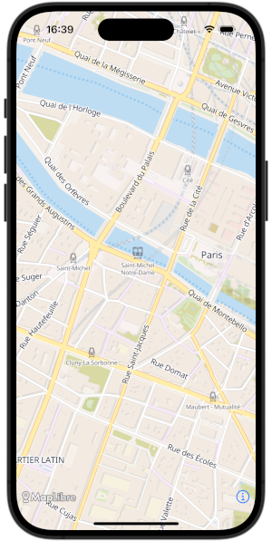
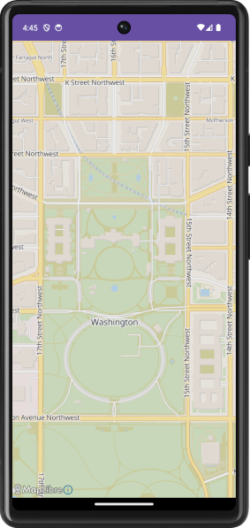

MapLibre also provides [MapLibre Native](https://maplibre.org) an open-source maps toolkit for Android, iOS and other platforms.

Since both MapLibre GL JS and MapLibre Native share the same [Style Specification](https://maplibre.org/maplibre-style-spec/), nothing special needs to be done to use Versatiles with MapLibre Native. For example, on iOS a Versatiles style URL can be passed to the initializer of [`MLNMapView`](https://maplibre.org/maplibre-native/ios/latest/documentation/maplibre/mlnmapview).

```swift
MLNMapView(frame: .zero, styleURL: URL(string: "https://tiles.versatiles.org/assets/styles/colorful/style.json")
```

While on Android you would call the `setStyle` method on a `MapView` to set the style:

```kotlin
mapView.getMapAsync { map ->
    map.setStyle("https://tiles.versatiles.org/assets/styles/colorful/style.json")
}
```

| [](../assets/versatiles-maplibre-ios.png) | [](../assets/versatiles-maplibre-android.png) |
| - | - |

Refer to the documentation of MapLibre Native for more information about using the toolkit.
